In this short tutorial we will show how by using [Omnibridge](https://docs.near.org/chain-abstraction/omnibridge/overview) and [AuroraCloud](https://app.auroracloud.dev/auth/login), you can start your own EVM chain with a custom token from other chains (e.g., Solana, Base, Ethereum).

To do this we will create a custom token, bridge it to NEAR and use corresponding fungible token (NEP-141 on NEAR) as a gas token for a virtual chain.

<!-- truncate -->

## Quick plan

In the previous articles:

- [Launching your base token using thirdweb](/blog/thirdweb-erc20)
- [Bridge-CLI: moving tokens with Omni Bridge](/blog/omnibridge-tutorial)

We have:

1. Created a custom token on Base.
2. Deployed that token via Omnibridge to NEAR -> get NEP-141 token there.
3. Deployed your virtual chain using that NEP-141 token.
4. Bridged your tokens from Base to NEAR.

So we will talk about the previous steps very briefly, and focus more on the next steps:

1. Deploy your virtual chain with that base token.
2. Bridge your tokens from NEAR inside your virtual chain.
3. Execute a transfer and pay gas fees in that token.
4. Collect the EVM gas to your NEAR wallet

## Requirements

We're expecting you to have your [MetaMask installed](https://metamask.io/faqs) and your wallet already created there. You can use any other EVM wallet too. E.g., Rabby, Brave or Coinbase Wallet.

Please, also make sure you have a NEAR wallet to be used, you can create one at [MyNearWallet](https://app.mynearwallet.com/).

Get some real funds there to pay for gas and token deployments. We recommend using [NEAR Intents](https://near-intents.org/) to swap and bridge tokens between different chains.

Please contact us on [Discord](https://discord.gg/auroralabs) if you will need any help with getting funds for gas fees.

## Creating a base token

To create your base token we recommend next variants:

- Use [Thirdweb](https://thirdweb.com/login). Here is [a quick tutorial](/blog/thirdweb-erc20).
- Use [OpenZeppelin](https://docs.openzeppelin.com/contracts/5.x/erc20) contracts.
- Or [Aurora Contracts](/build-a-dapp/contracts/erc-20).
- For Solana you can use [`spl-token` CLI tool](https://www.solana-program.com/docs/token).

## Deploying token to NEAR

Now, you will need to use OmniBridge to bridge that base token to the NEAR Network.
Please, make it by following instructions in this [blog article](/blog/omnibridge-tutorial).

## Deploying your virtual chain

To deploy your chain you will need to:

1. Create an account on [Aurora Cloud].
2. Log in into your account.
3. Configure your chain setup.
4. Deploy the chain.

This video demonstrates how it is done in just 1 min:

<iframe width="560" height="315" src="https://www.youtube.com/embed/ChGraS1RSoc?si=V8n8YfgGMdR9VcsB" title="YouTube video player" frameborder="0" allow="accelerometer; autoplay; clipboard-write; encrypted-media; gyroscope; picture-in-picture; web-share" referrerpolicy="strict-origin-when-cross-origin" allowfullscreen></iframe>

Let's follow it step-by-step below, and also cover how to configure the custom base token.

### Create account

Go to [Aurora Cloud] website and click "Sign In" button:

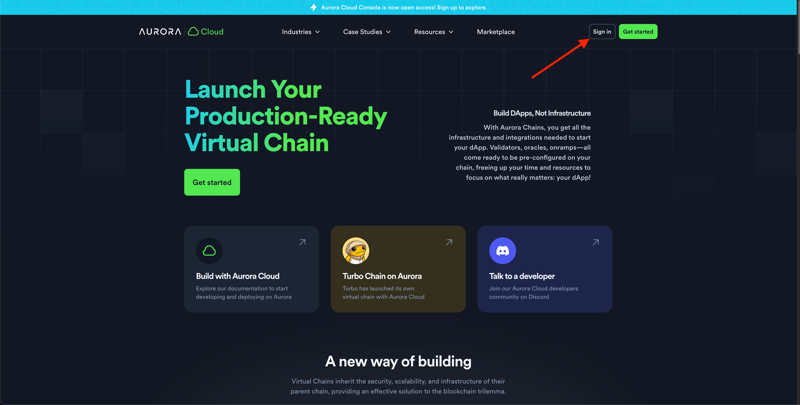

Click "Create account" link if you do not have one:


And fill the needed information here, create an account by clicking "Sign Up" button:

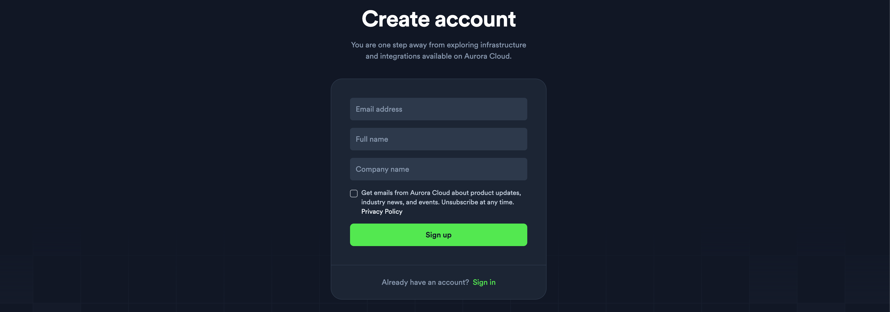

After that go to ["Sign In"](https://app.auroracloud.dev/auth/login) page and log in there, you will see the next screen after that:

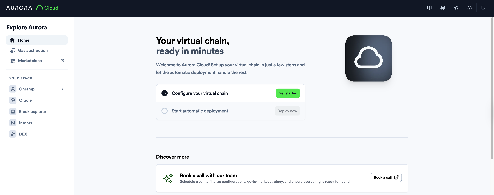

### Configure your chain

After clicking the "Get started" button on the screenshot above, you will see:


Choose your chain permissions first. Usually the chain will have "Public" permissions, so just choose it.
With the "Permissioned" ones you will be able to block some people from deploying smart contracts or interacting with a chain. If needed, this could be easily changed in the future for any "Public" chain.

Now, scroll a bit down. You will see Base Token selection, choose "My Token" to deploy your token created in the [previous article](/blog/omnibridge-tutorial):


:::note
Of course, you can use any of the already predefined tokens, as AURORA, ETH, USDC, BTC, etc. It will make the deployment faster. We're just covering the most general case here for the educational purposes.
:::

Enter your [token address](/blog/omnibridge-tutorial#deploying-token-to-near-1) into the text input:

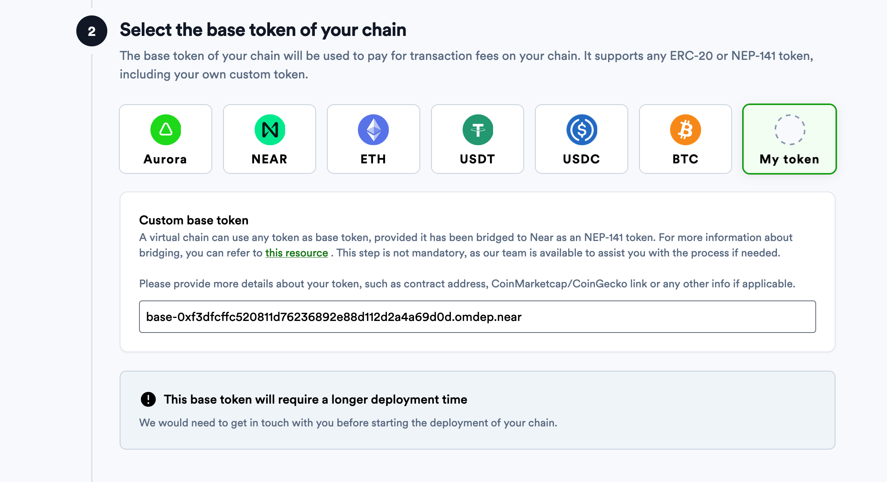

:::note
We're using [this token](https://nearblocks.io/address/base-0xf3dfcffc520811d76236892e88d112d2a4a69d0d.omdep.near) from the [previous tutorial](/blog/omnibridge-tutorial).
:::

Add chain information, and click "Save my chain configuration" button:


### Deploy your chain

Now, you're ready to deploy your chain, click "Deploy now" button and confirm all of the popups there:


After this we will receive an automatic notification about your chain deployment, and when we'll address it - you will get your chain working.

:::info
Note, that we need to do some manual operations during the chain deployment only if you're using a custom base token. So, if you use some pre-defined token – it will automatic and ready in seconds to be used! 
:::

When everything is ready, you will see:

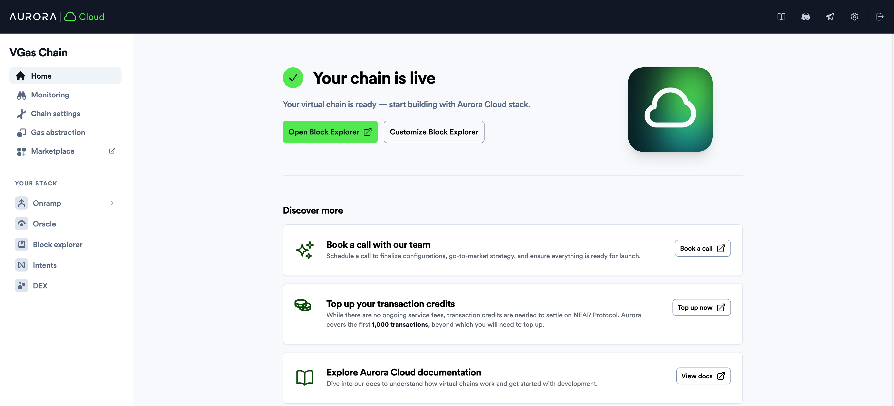

### Chain Information

You can find all of the important information about your chain inside the "Chain Settings" tab located at the left sidebar:


Let us describe some of these for you:

- Engine Account - is a NEAR smart contract realizing your EVM on NEAR. You can actually go and inspect it on [NearBlocks](https://nearblocks.io/address/0x4e454265.c.aurora).
- RPC URL - `https://0x4e454265.rpc.aurora-cloud.dev` your blockchain node URL, to which you can point your wallets or developer environments.
- Explorer - [`https://0x4e454265.explorer.aurora-cloud.dev`](https://0x4e454265.explorer.aurora-cloud.dev) your Explorer URL, where you can inspect your EVM transactions.

### Adding a chain to your wallet

To add your chain to your Metamask, just click the 'Add to Metamask' button on "Chain Settings" page.

You can find it at the "Chain details" section, right below the same-named label seen on the screenshot above.

After that you will be able to see your gas token and erc-20 balances in your wallet:

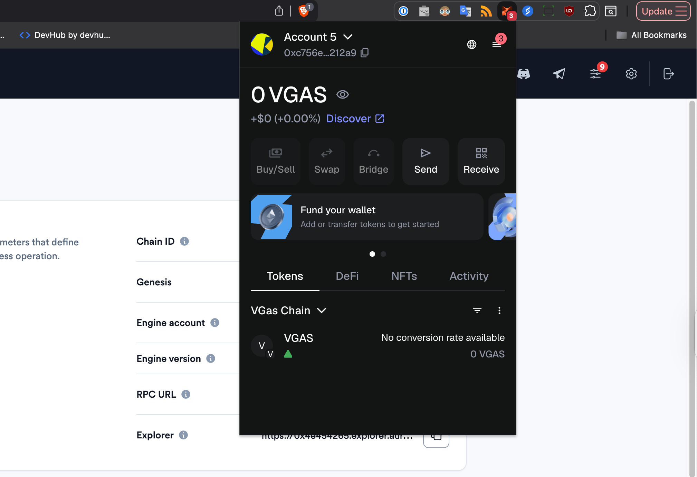

As well as transaction history.

### Gas management

You can also examine the amount of the transactions supplied for your chain at "Gas abstraction" tab's section "Gas consumed":

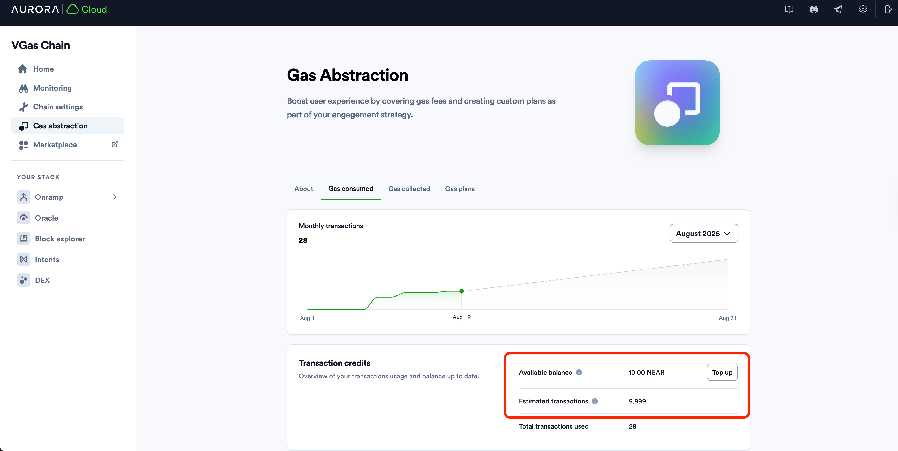

As you can see, you have 10 NEAR of balance on your Engine contract, which is equal to 10000 free transactions.

The way the virtual chain works is that it pays for your EVM transactions on NEAR from the engine account while accumulating the EVM gas for you on its in-EVM account.

You can see how much of the EVM chain your chain has accumulated in "Gas collected" section:

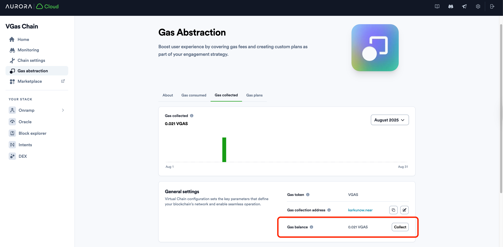

You could also set your "Gas collection address" to withdraw that gas token to it later via clicking "Collect" button seen above.

## Setting the gas price

Now, let's set up non zero gas price on your blockchain. This ensures that:

- Your users will pay the gas fees for the on-chain actions.
- You will collect these gas fees to extract the value from your chain.

You can check in your terminal that the current gas price is zero by using [`eth_gasPrice`](https://www.quicknode.com/docs/ethereum/eth_gasPrice) RPC method:

```bash
curl https://0x4e454265.rpc.aurora-cloud.dev \
  -X POST \
  -H "Content-Type: application/json" \
  --data '{"method":"eth_gasPrice","params":[],"id":1,"jsonrpc":"2.0"}'
```

You will get:

```bash
{"jsonrpc":"2.0","id":1,"result":"0x0"}%
```

You may ask - how to set it in the right way? How should I calculate the value?
The long answer is described in [this article](/blog/evm-gas-near-gas-on-aurora) describing the interplay between the NEAR gas and EVM gas in detail.

The short one – just use `0.07GWei` price (in ETH) - which is the default price on Aurora Mainnet at the moment of the publication of this article.

Convert it proportionally to your token price and you will get the right number. But what if you don't have the price for your token yet? Don't worry just set it small enough then and correct it later!

I will use `0.000001` value and will enter it into to the `Gas price` field at the bottom of the page:

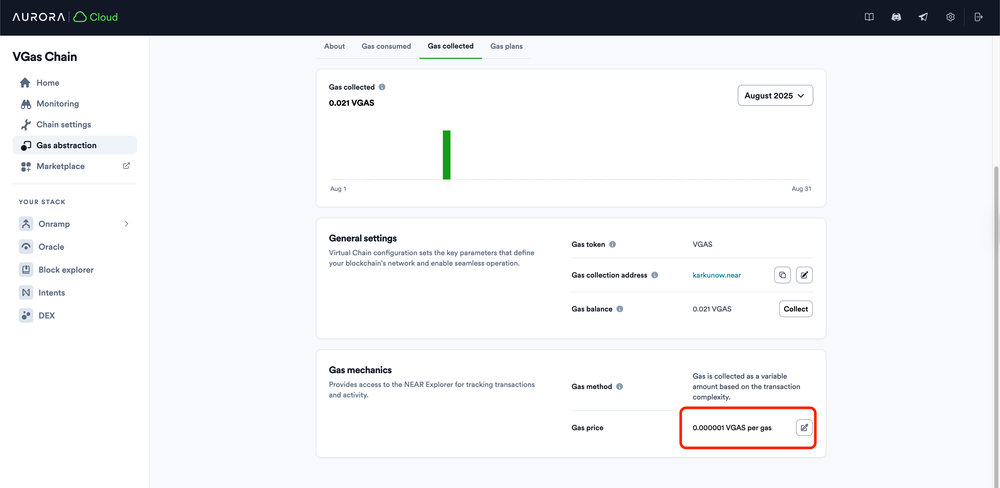

Now, if I will call `eth_gasPrice` method in my terminal - I get:

```bash
{"jsonrpc":"2.0","id":1,"result":"0xe8d4a51000"}%
```

If you [decode that hex number](https://www.rapidtables.com/convert/number/hex-to-decimal.html) into the decimal format, you will see that this is exactly the gas price you have set in the UI.

## Fund your EVM account

Now, if you will want to execute anything - like a coin transfer or smart contract deployment you will need to have a base token on your account. Right now your balance should be 0, as we have seen when your [was added](/blog/create-virtual-chain#adding-your-new-chain-to-your-wallet) to your wallet.

After following steps described in the [previous article](/blog/omnibridge-tutorial), you got your base token from other blockchain to NEAR.

Now, it is time to bridge it to your address inside your virtual chain.

To do this, we will use [NEAR CLI](https://docs.near.org/tools/near-cli). Go to the [official docs](https://docs.near.org/tools/near-cli) and follow installation instructions there.

For Mac/Linux you can use:

```bash
curl --proto '=https' --tlsv1.2 -LsSf https://github.com/near/near-cli-rs/releases/latest/download/near-cli-rs-installer.sh | sh
```

After that import you NEAR Wallet account, if you're using MyNearWallet, with this command executed in your terminal:

```bash
near account import-account using-web-wallet network-config mainnet
```

Then, the browser window will open where you will need to import your account:


And when finished, go back to the console and enter your account name there, then press "Enter":

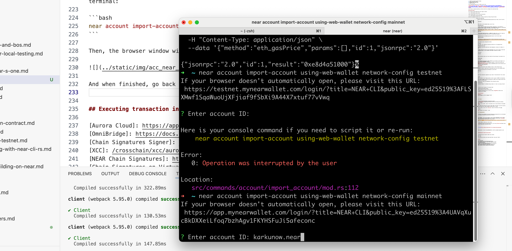

Account will be added to your NEAR CLI config inside your terminal after that.

Now, to bridge the funds all you will need to do is executing the next command:

```bash
near contract call-function as-transaction <TOKEN_ADDRESS_ON_NEAR> ft_transfer_call json-args '{"receiver_id": <ENGINE_CONTRACT>,  "amount": <AMOUNT>, "msg": <EVM_ADDRESS_LOWERCASED>}' prepaid-gas '300.0 Tgas' attached-deposit '1 yoctoNEAR' sign-as <NEAR_WALLET> network-config mainnet
```

You will need to fill the right values for the `<...>` placeholders in the command above. In my particular case they are:

- `<TOKEN_ADDRESS_ON_NEAR> = base-0xf3dfcffc520811d76236892e88d112d2a4a69d0d.omdep.near`
- `<ENGINE_CONTRACT> = "0x4e454265.c.aurora"`
- `<AMOUNT> = "10000000000000000000"`
- `<EVM_ADDRESS_LOWERCASED> = "dde068fd58fd10ed15d0f68fc7cd214237a1e9af"`
- `<NEAR_WALLET> = karkunow.near`

:::note
You need to lowercase the EVM address, which should be your EVM wallet or smart contract address you want to fund on your virtual chain.
:::

So, the final command will look like:

```bash
near contract call-function as-transaction base-0xf3dfcffc520811d76236892e88d112d2a4a69d0d.omdep.near ft_transfer_call json-args '{"receiver_id": "0x4e454265.c.aurora",  "amount": "10000000000000000000", "msg": "dde068fd58fd10ed15d0f68fc7cd214237a1e9af"}' prepaid-gas '300.0 Tgas' attached-deposit '1 yoctoNEAR' sign-as karkunow.near network-config mainnet
```

After executing, you will receive your NEAR transaction hash and can take a look at it in the [NEARBlocks].

If you now go to your MetaMask, you will see the balance updated:


## Executing transaction inside EVM

Now, we ready to execute your first transaction in your virtual chain. Let's execute a transfer of some gas tokens to your another account to test it out.

First of all, create another account in MetaMask, click on your Account Name:

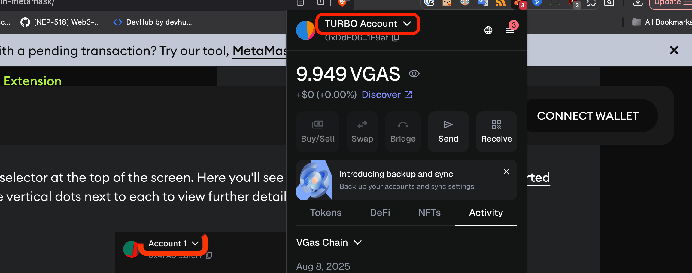

You will see Accounts Dropdown. Now, click on the "Add account or wallet" button and create a new account:


Choose "Ethereum account" type to add:


After that enter the name of the account and click "Add" button. Account will be created.
Switch back to your old account.

Now let's send some tokens to your freshly created account, click "Send":

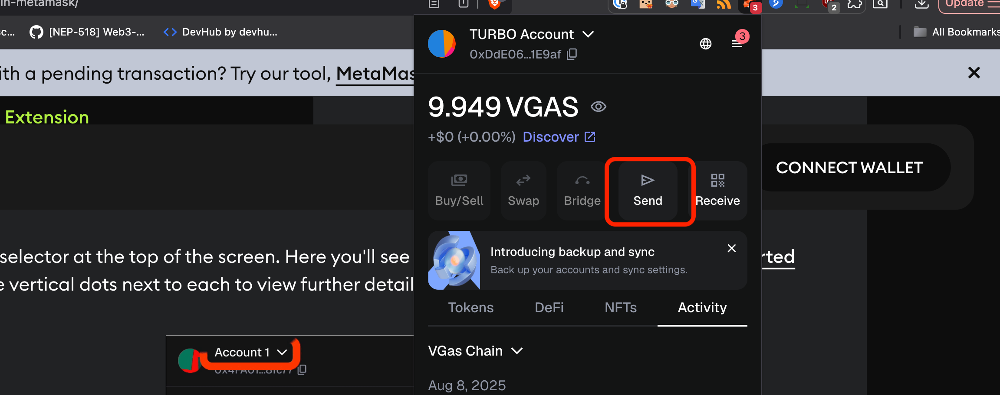

Choose you new account in the "To" field, enter some amount of tokens to transfer, and click "Continue":

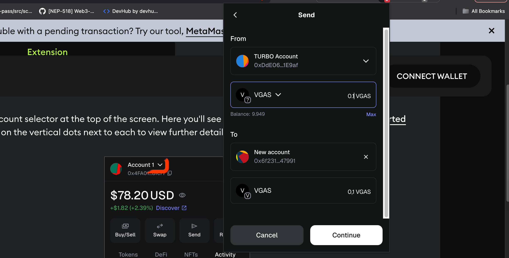

Then, review the data and click "Confirm":


You will the balance on your new account updated:

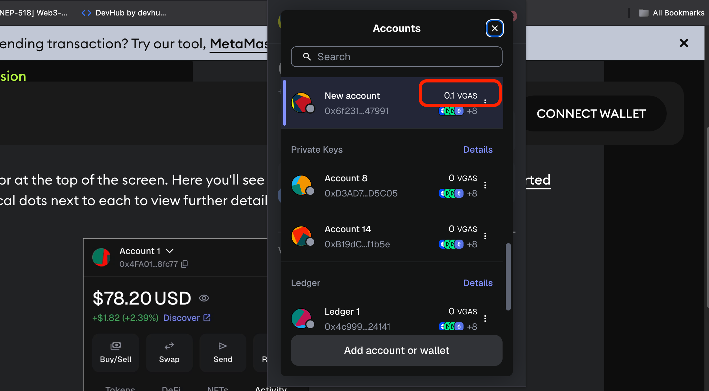

To find the transaction in the Explorer, go to the MetaMask main view, locate your transfer there, and click on it:


After that click on "View on block explorer" button:


The new window will open where you can see more details, gas consumed and copy [transaction URL](https://0x4e454265.explorer.aurora-cloud.dev/tx/0x1d8b006066402bf05b05b3bb3d6dc75df9b2fa0dfc26a2f7ce507c6b07425560) or hash if needed:


If you want, execute a few more transactions now, or [deploy some smart contracts](/build-a-dapp/introduction) to your virtual chain to collect more gas on your relayer account.

## Collect the gas to your NEAR account

After users has had some activity on your virtual chain, you can collect the gas in the [Aurora Cloud] Console. To do this, go to "Gas abstraction", and then to the "Gas collected" tab:

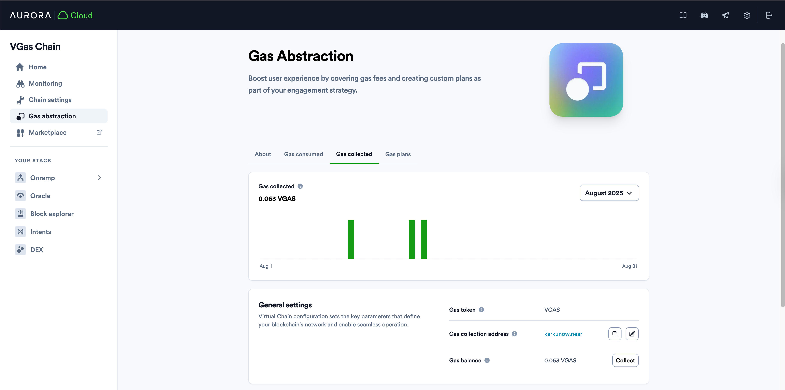

You will see the amount of gas accumulated there. Please, enter your NEAR account there if you haven't done this previously. It should be your NEAR wallet address.

After that, click "Collect" button, you will see a popup:

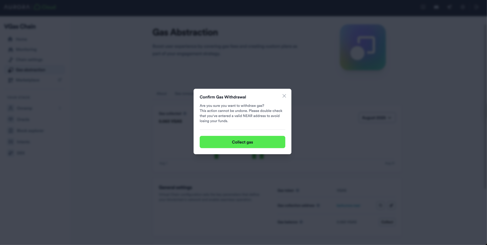

Click "Collect gas" and your gas will be transfered to the specified NEAR account. You can find that transaction on NEARBlocks Explorer:


Here are the details from the particular transaction I had:

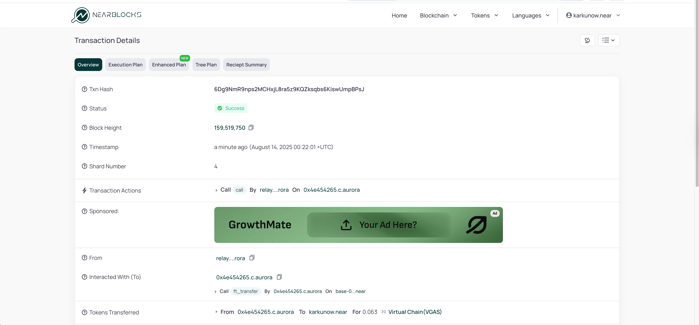

As you can see `0.063 VGAS` were transferred to my account.

## Conclusions

In this article we have successfully:

- Set up a new chain with a custom base token
- Learned about how NEAR gas is related to the EVM gas
- Funded our EVM account with the base token
- Executed some simple transactions 
- Collected some gas tokens to our NEAR wallet

That is it for today! Hope you have enjoyed it! 

If you have encountered any errors, problems or just have any questions or suggestions, please contact us on [Discord](https://discord.gg/auroralabs).

[Aurora Cloud]: https://app.auroracloud.dev/
[OmniBridge]: https://docs.near.org/chain-abstraction/omnibridge/overview
[NEARBlocks]: https://nearblocks.io/
