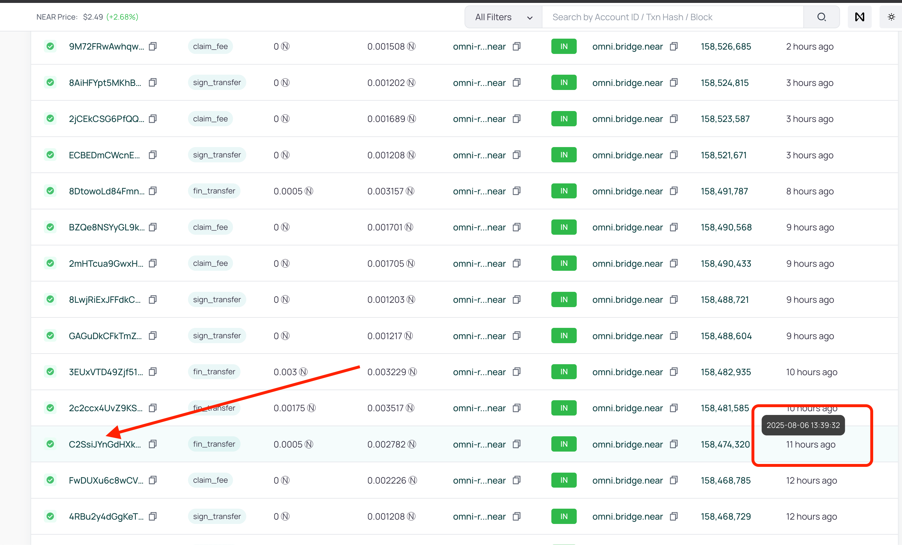
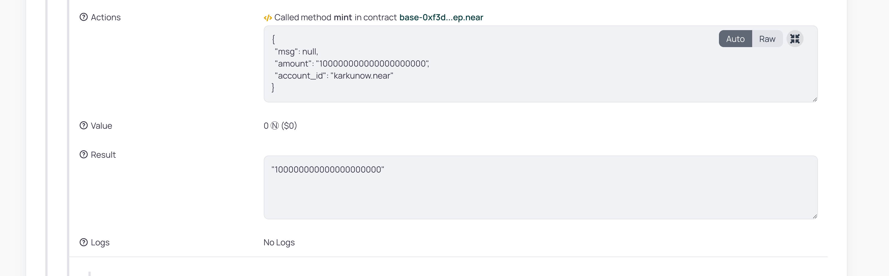

In this short tutorial we will show how by using [Omni Bridge](https://docs.near.org/chain-abstraction/omnibridge/overview) you can bring your custom token from other chains (e.g., Solana, Base, Ethereum) to NEAR ecosystem.

To do this we have created a custom token called [VGAS](https://base.blockscout.com/token/0xF3dFcfFc520811D76236892e88d112D2A4a69D0d) on Base already in [previous tutorial](/blog/thirdweb-erc20).

Now, we want to bridge it to NEAR and use corresponding fungible token (NEP-141 on NEAR) as a gas token for a virtual chain in the next article.

<!-- truncate -->

## Quick plan

We're going to:

1. Install Rust
2. Install `bridge-cli`
3. Configure `.env` variables for `bridge-cli`
4. Deploy [VGAS] via Omni Bridge to NEAR to get NEP-141 token there.
5. Bridge some of your tokens from Base to NEAR.

## Requirements

Please, create or prepare any ERC-20 token from Base, Arbitrum or Ethereum to be used.
You can also try this out with SPL tokens on Solana. We will use the [VGAS] token from the [thirdweb ERC-20 tutorial](/blog/thirdweb-erc20).

We're expecting you to have your [MetaMask installed](https://metamask.io/faqs) and your wallet already created there. You can use any other EVM wallet too. E.g., Rabby, Brave or Coinbase Wallet.

You also will need your NEAR wallet prepared. We recommend using [MyNearWallet](https://www.mynearwallet.com/), but any other will suffice. You will just need to take your private key out of it and use it in `bridge-cli`.

Also, please get some real funds there to pay for gas and token deployments. You will need 3+ NEAR to be on your NEAR wallet and some ETH present on your Base wallet.
We recommend using [NEAR Intents](https://near-intents.org/) to swap and bridge tokens between different chains.

Please contact us on [Discord](https://discord.gg/auroralabs) if you will need any help with getting funds for gas fees.

## Installing Rust

We will use a Rust library called [bridge-sdk-rs] of which [bridge-cli] is a part of.
So, let's install Rust first by using the next command on Mac or Linux:

```bash
curl https://sh.rustup.rs -sSf | sh
```

If you're using Windows, please follow instructions on [rust-lang.org](https://doc.rust-lang.org/cargo/getting-started/installation.html).

## Installing bridge-cli

### Download binary

Visit [releases page](https://github.com/Near-One/bridge-sdk-rs/releases/latest) to download a binary for your platform

### Manual compilation

```bash
# Clone the repository
git clone https://github.com/near-one/bridge-sdk-rs.git
cd bridge-sdk-rs

# Build the CLI
cargo build --release

# The binary will be available at
./target/release/bridge-cli
```

### Put that binary on your $PATH

:::note
The PATH variable is an environment variable that specifies a list of directories that the operating system searches when you enter a command. It allows you to run commands and programs without specifying their full path, making it easier to use the command line.
:::

You can read more about what is [$PATH variable](https://en.wikipedia.org/wiki/PATH_(variable)) on Wiki.
And [a detailed tutorial](https://jvns.ca/blog/2025/02/13/how-to-add-a-directory-to-your-path/) on how to change it.

Overall, you can just open your favorite terminal, I will use [iTerm2](https://iterm2.com/) and enter:

```bash
echo $PATH
```

You will see something like:

```bash
/Users/aurora/Library/pnpm:/Applications/Sublime Text.app/Contents/SharedSupport/bin:/Users/aurora/bin:/Users/aurora/.cargo/bin:/Users/aurora/.foundry/bin
```

It is just a bunch of folders concateneted by ':' symbol. So you can take one of these, e.g., `/Users/aurora/.foundry/bin` in my case, and put `bridge-cli` binary there.

After that you will able to execute the next command in your terminal:

```bash
bridge-cli --help
```

and get

```bash
Usage: bridge-cli <NETWORK> <COMMAND>

Commands:
  log-metadata                      Log metadata for a token
  deploy-token                      Deploy a token
  is-transfer-finalised             Check if transfer is finalised
  near-storage-deposit              Deposit storage for a token on NEAR
  near-sign-transfer                Sign a transfer on NEAR
  near-init-transfer                Initialize a transfer on NEAR
  near-fin-transfer-with-evm-proof  Finalize a transfer on NEAR using EVM proof
  near-fin-transfer-with-vaa        Finalize a transfer on NEAR using VAA
  near-fast-fin-transfer            Finalize a transfer on NEAR using fast transfer
...
```

If `bridge-cli` is not on your PATH, you will see something like that:

```bash
zsh: command not found: bridge-cli
```

### Configuring .env file

Let's configure enviroment variables now. To do this, create the `.env` file in your current folder:

```bash
touch .env
```

Open it in your favorite text editor, I will use Sublime Text, and enter the next info:

```.env
# e.g. karkunow.near
NEAR_SIGNER=<signer-account-id> 
NEAR_PRIVATE_KEY=<signer-private-key>
BASE_PRIVATE_KEY=<base-private-key>

# mainnet
TOKEN_LOCKER_ID=omni.bridge.near
```

Optionally, you can provide also:

```.env
# testnet
# TOKEN_LOCKER_ID=omni-locker.testnet

# ARB_PRIVATE_KEY=<arbitrum-private-key>
# ETH_PRIVATE_KEY=<eth-private-key>

# you can provide solana's keypair as base58 string
# SOLANA_KEYPAIR=<solana-keypair-bs58>
# or by providing an absolute path to the file where keypair is stored
# SOLANA_KEYPAIR=/Users/.../solana-wallet.json
```

But we won't need Solana, Eth or Arbitrum keys in this tutorial.

As you can see, we will need to get our EVM wallet and NEAR wallet private keys and put them to the `.env` file.Here is [a tutorial](https://support.metamask.io/configure/accounts/how-to-export-an-accounts-private-key/) on how to do it in MetaMask.

For the [MyNearWallet]:

- go to your [account page](https://app.mynearwallet.com/profile)
- scroll down to the bottom and click "Export Local Private Key" button
- enter your account id in the popup
- click "View Private Key"
- copy it your `.env` file

"Export Local Private Key" button is located here:


Now, when your `.env` file is ready, go to your terminal and execute:

```bash
source .env
```

## Deploying token to NEAR

Now, let's take our [VGAS] token and try to deploy it to NEAR. But before doing that note the next information.

:::note

- You have to wait for around 20 minutes for transaction confirmation after calling any method on EVM chain. Otherwise, you'll get ERR_INVALID_BLOCK_HASH meaning that light client or wormhole is not yet synced with the block that transaction was included in
- Replace placeholder values (addresses, amounts, hashes) with actual values
- Token amounts are specified in their smallest units (e.g., wei for ETH, yoctoNEAR for NEAR)
- Always test with small amounts on testnet first
- Ensure you have sufficient funds for gas fees and storage deposits

:::

### Log metadata

First, we will need to log the token's metadata. To do that we will use `log-metadata` command and VGAS token address `0xF3dFcfFc520811D76236892e88d112D2A4a69D0d` with `base:` prefix in front of it:

```bash
# Log VGAS token metadata on Base
bridge-cli mainnet log-metadata --token base:0xF3dFcfFc520811D76236892e88d112D2A4a69D0d
```

After that, we will get:

```bash
2025-08-05T22:24:45.499822Z LOG METADATA: Sent new bridge token transaction
tx_hash="0xa7c4284c84a847ec8938b15dd14c4ca83da8d49439615561c229b7411b809e4c"
```

If we examine [the transaction](https://basescan.org/tx/0xa7c4284c84a847ec8938b15dd14c4ca83da8d49439615561c229b7411b809e4c) via Basescan we will see that it took only $0.001 from our account.

### Deploying token to NEAR

To deploy your token to NEAR you will need to wait now around 20 minutes for transfer to be catched up by the Omnibridge services. So you can relax, and get you some tea at this moment. Meditate or just gaze around, relax a bit :)

:::note
EVM part, except Ethereum, is covered right now by the Wormhole bridge (in future, it will secured by Chain Signatures on NEAR). So, you can also monitor your transactions via [WormholeScan](https://wormholescan.io/#/txs?address=0xBe3e4Cb196bC9579c1C161cA5a2A4D47eD439469&network=Mainnet). When available there, you can try executing `deploy-token` method.
:::

After that, be ready to execute:

```bash
bridge-cli mainnet deploy-token \
    --source-chain Base \
    --chain Near \
    --tx-hash 0xa7c4284c84a847ec8938b15dd14c4ca83da8d49439615561c229b7411b809e4c
```

As you can see, I have used the `log-metadata` transaction hash in the command above. You will see an output similar to the next one:

```bash
2025-08-05T22:48:51.107287Z DEPLOY TOKEN: Sent deploy token transaction
tx_hash="EPJWeaHRZWZBf49YgYDj55oHefSZPgQmRye2WsnnbxRv"
```

Now, if you take a look at the details of that transaction on [Nearblocks](https://nearblocks.io/txns/EPJWeaHRZWZBf49YgYDj55oHefSZPgQmRye2WsnnbxRv), you will see that:

1. It spent 3.00771 NEAR from `karkunow.near` account
2. It called `deploy_token` method on `omni.bridge.near` contract.
3. In the `Interacted With` field, you can notice a new account created there and 3 NEAR got deposited into it.

Here is how it looks like in the `Interacted With` field:


This is exactly [the NEP-141 token account](https://nearblocks.io/address/base-0xf3dfcffc520811d76236892e88d112d2a4a69d0d.omdep.near) which is a bridged version of the [VGAS] token, but now on NEAR!

As you can see, [its name](https://nearblocks.io/address/base-0xf3dfcffc520811d76236892e88d112d2a4a69d0d.omdep.near) mirrors the Base ERC-20 name, but has a prefix `base-` and suffix `.omdep.near` added, with lowercased ERC-20 address in-between these.

## Bridging your tokens

Now, I want to move 100 VGAS from Base to NEAR.

To initialize the transfer we'll need to estimate fees first by providing recipient, sender and token to the API:

```bash
curl 'https://mainnet.api.bridge.nearone.org/api/v1/transfer-fee?recipient=near:karkunow.near&sender=base:0xBe3e4Cb196bC9579c1C161cA5a2A4D47eD439469&token=base:0xF3dFcfFc520811D76236892e88d112D2A4a69D0d'
```

We have used the next arguments above:

- Recipient: near:karkunow.near
- Sender: base:0xBe3e4Cb196bC9579c1C161cA5a2A4D47eD439469
- Token: base:0xF3dFcfFc520811D76236892e88d112D2A4a69D0d

The command will output us:

```bash
{"native_token_fee":"3273397399996","transferred_token_fee":null,"usd_fee":0.01}
```

`usd_fee` just shows how much it will cost to us to execute the bridge transaction on Base in USD. But we won't need that field for now.

We should use `native_token_fee` as `native_fee` and `transferred_token_fee` as `fee` in the initialization command. Let's initialize transfer on Base by using these values:

```bash

bridge-cli mainnet evm-init-transfer \
    --chain base \
    --token 0xF3dFcfFc520811D76236892e88d112D2A4a69D0d \
    --amount 100000000000000000000 \
    --recipient near:karkunow.near \
    --fee 0 \
    --native-fee 3273397399996 \
    --message ""
```

:::tip
Leave `--message` to be an empty string if you're making transfer to the regular NEAR account, it should be used only to call methods on the NEAR smart contracts.
:::

I have used [Wei converter](https://www.eth-to-wei.com/) to get 18 decimals for my 100 VGAS transfer to get the correct number with 18 decimals.

I get this as an output after execution of the command above:

```bash
2025-08-06T13:17:52.048469Z EVM INIT TRANSFER: Sent transfer transaction
tx_hash="0x7df8da588a7894ce666aa374b37ccb9c00bb454d97f92cc30be2578762c5237a"
```

If you'll [go to the Basescan](https://basescan.org/tx/0x7df8da588a7894ce666aa374b37ccb9c00bb454d97f92cc30be2578762c5237a), you will see that inside that transaction `initTransfer` method was called on the bridge Base contract:


Then you will need to wait for around 20-25 minutes for that action to be accepted by Omni Bridge services.

Just a reminder, for Base and Arbitrum, you can also monitor your transactions via [WormholeScan](https://wormholescan.io/#/txs?address=0xBe3e4Cb196bC9579c1C161cA5a2A4D47eD439469&network=Mainnet).

If you go to WormholeScan and enter your base EOA there, you will see a list of your bridge-related transactions there:


The status will switch to `COMPLETED` in 20-25 minutes, the transaction info will look like this:



Transaction will be finalized automatically for you by `omni-relayer.bridge.near` account on the NEAR side.

## Finding finalization transaction

Note the time of transaction from WormholeScan screenshot above, it is `2025-08-06 13:17:53 UTC` in this case. 

Now, if you want to find the finalization transaction, go to the [Omni Bridge Relayer](https://nearblocks.io/address/omni-relayer.bridge.near) on NearBlocks, and find the transaction there with a timestamp around that time plus 20 minutes, so it should be `2025-08-06 13:37:53 UTC`.

You could hover on the `AGE` field to see timestamps, like this:


As you can see there is only one close enough to my time here. Let's click on it, and then scroll `Interacted With (To)` list of event until you see `mint` functions on `base-...` contract:


When you click on the small arrow near the `mint` event you will be redirected to the `Execution Plan` tab, and see more info about it:



You should see the exact info you have passed to the `evm-init-transfer` command above!

That is it, you now have your tokens on your balance, which you can check in your NEAR Wallet, e.g., [MyNearWallet].

## Conclusions

That is it! We have bridged your first tokens via Omni Bridge CLI together!

You can take a look at the transactions which happened during this tutorial on block explorer:

- [Log metadata - $0.001](https://basescan.org/tx/0xa7c4284c84a847ec8938b15dd14c4ca83da8d49439615561c229b7411b809e4c)
- [Deployment transaction on NEAR - $7.49 or 3.01 NEAR, out of which $7.47 went for storage](https://nearblocks.io/txns/EPJWeaHRZWZBf49YgYDj55oHefSZPgQmRye2WsnnbxRv)
- [Bridge transaction - $0.012](https://basescan.org/tx/0x7df8da588a7894ce666aa374b37ccb9c00bb454d97f92cc30be2578762c5237a)

Deployment cost: $0.033
Storage cost: $7.47 (3 NEAR)

If you are ready - let's start a new virtual chain with that token now in [the next article](/blog/create-virtual-chain)!

If you have encountered any errors, problems or just have any questions or suggestions, please contact us on [Discord](https://discord.gg/auroralabs).

[Omni Bridge]: https://docs.near.org/chain-abstraction/omnibridge/overview
[VGAS]: https://base.blockscout.com/token/0xF3dFcfFc520811D76236892e88d112D2A4a69D0d
[bridge-sdk-rs]: https://github.com/Near-One/bridge-sdk-rs
[bridge-cli]: https://github.com/Near-One/bridge-sdk-rs/tree/main/bridge-cli
[MyNearWallet]: https://app.mynearwallet.com/
[Wormhole VAA Parser]: https://wormholescan.io/#/developers/tools/vaa-parser
