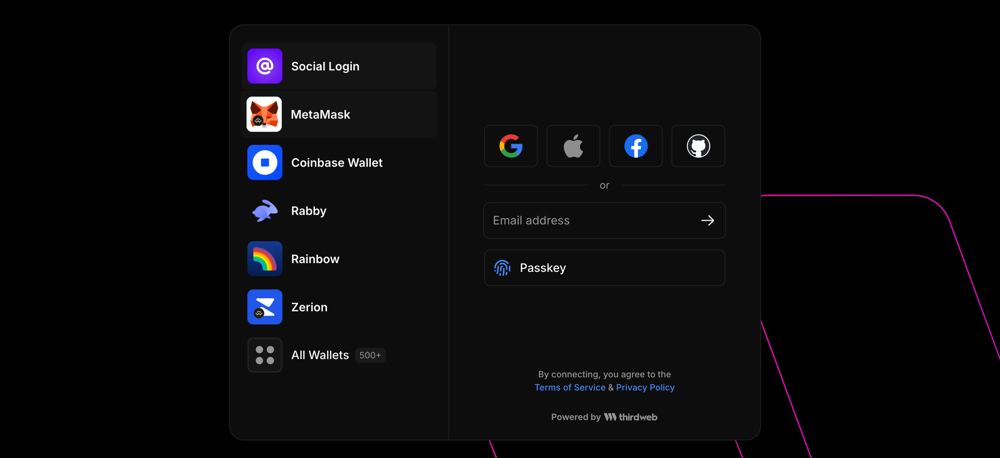
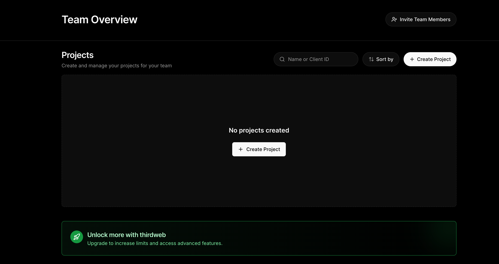
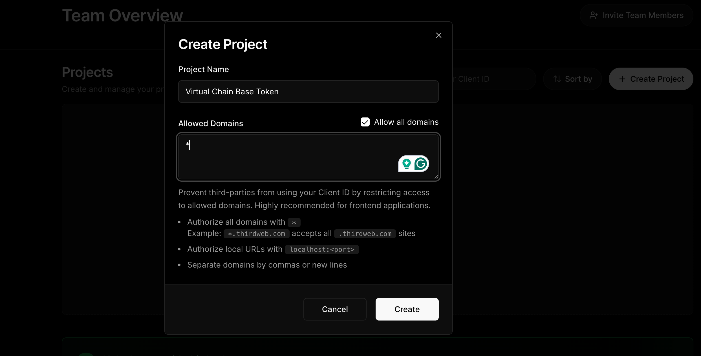
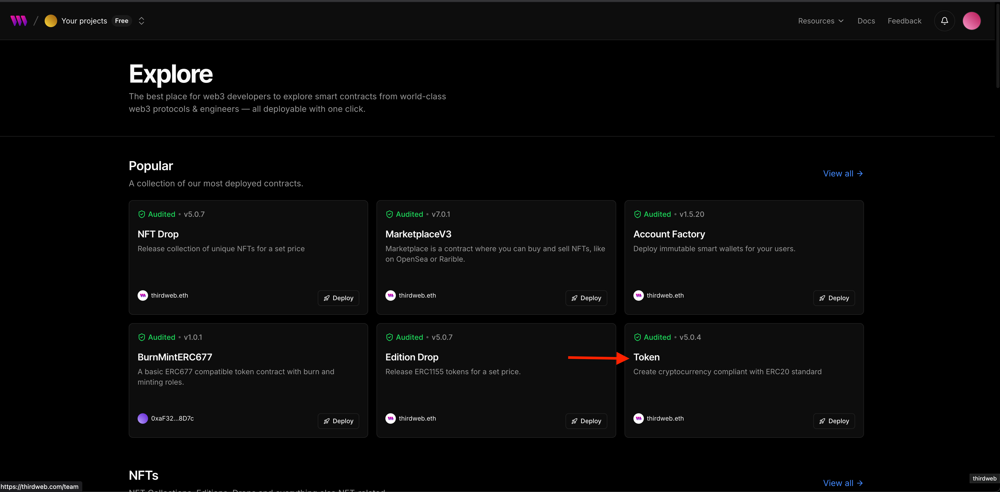
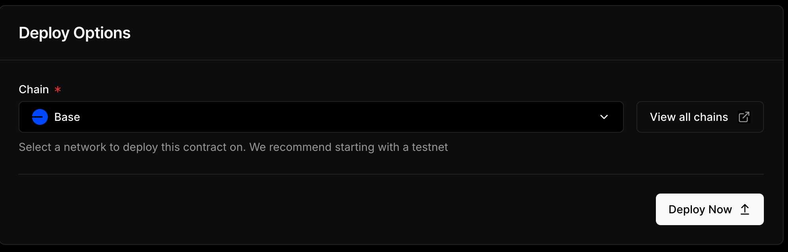
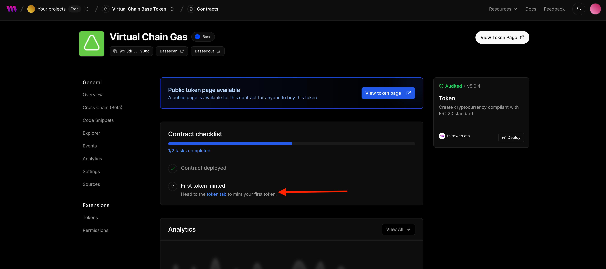
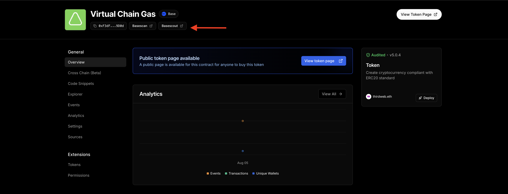
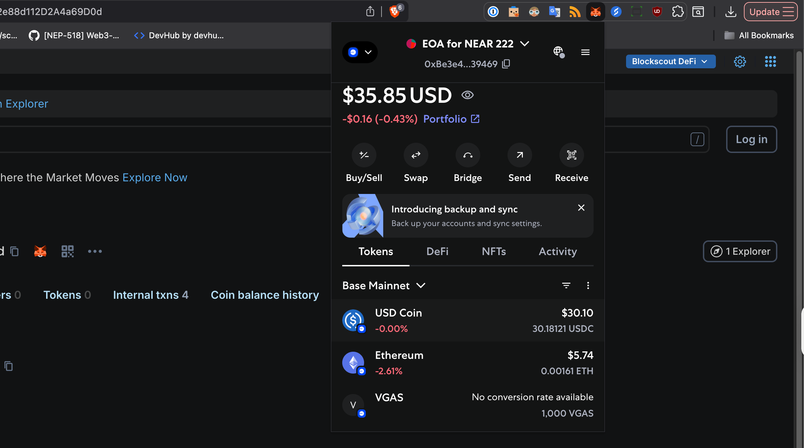

If a developer wants to have their own base token for a [virtual chain] launched via [AuroraCloud](https://app.auroracloud.dev/auth/login), they can use, for example, [OpenZeppelin](https://docs.openzeppelin.com/contracts/5.x/erc20) or [Aurora Contracts](/build-a-dapp/contracts/erc-20).

But what if you're just a beginner in the web3 world? [thirdweb](https://thirdweb.com/) comes to the rescue here and provides an easy UI to do exactly that - deploy, mint, burn your own ERC-20, and even allows conducting airdrops with it.

Of course, to be used as a base token for your [virtual chain] that token will need to be bridged to NEAR first via [OmniBridge], but we will discuss that in the next article.

<!-- truncate -->

## Quick plan

We're going to:

1. Register on thirdweb
2. Create a thirdweb project
3. Add a new contract (ERC-20) to the project
4. Deploy ERC-20 contract and mint tokens
5. Add that ERC-20 to your MetaMask wallet

## Requirements

We're expecting you to have your [MetaMask installed](https://metamask.io/faqs) and your wallet already created there. You can use any other EVM wallet too. E.g., Rabby, Brave or Coinbase Wallet.

Also, please get some real funds there to pay for gas and token deployments.
We recommend using [NEAR Intents](https://near-intents.org/) to swap and bridge tokens between different chains.

Please contact us on [Discord](https://discord.gg/auroralabs) if you will need any help with getting funds for gas fees.

## Creating thirdweb account

So, let's go to thirdweb and login there with your wallet:

Next, create your account:

## Creating thirdweb project

After that you will see your dashboard there:

Click "Create Project" button. You will see a popup, enter a name and click "Allow all domains" checkbox there:

Now, click "Create". You will see a popup with your secret key:

Save your secret key in a safe place, such as a password manager inside your browser. Then, tick the checkbox "I confirm that I have securily stored my secret key" and click "View Project". You will see:

## Deploying a contract

Click "Contracts" at the sidebar, you will see:

Click "Discover Contracts" and choose "Token" contract, which is just a regular [ERC-20](https://docs.openzeppelin.com/contracts/5.x/erc20):

Then, click "Deploy Now" button:

Now, enter your token information:

You can also provide the image for you token above. After that scroll to the bottom of the form and make sure you have Base network (or Arbitrum) selected:

Wait a bit and confirm the transaction in MetaMask:

After that, you will see your token deployed succesfully:

## Minting tokens

You will be redirected here, after clicking "View Contract" above:

As you can see, you need to mint tokens now. So click on "token tab" link above, you will go here:

Click "Mint" button, you will see a side menu. Enter amount of tokens there (I will mint 1000) and click "Mint Tokens" button:

Sign a transaction in your wallet:

After that you will receive minted tokens to your account.

## Adding token to your wallet

To see your tokens inside your wallet, please click the Basescout button on your token dashboard:

You will see this page opening up, click on the MetaMask icon near the token address:

You will see MetaMask popup asking you to add a new token, click "Add" button:

After that you will see your token balance in your wallet:

## Conclusion

We have deployed and minted a simple ERC-20 token to be used as a base token on your [virtual chain].
You can take a look at the transactions which happened during this tutorial on block explorer:

- [Deployment transaction - $0.015](https://base.blockscout.com/tx/0x5b2fb531f8849b34343f728604a8c0a0a2379c7a5042d556255932acaa86bc51)
- [Minting transaction - $0.003](https://base.blockscout.com/tx/0x3e44f730b818c5e269b6387df1c13595418b1771d11e98838cca7dc48c4fd05a)

Total cost of creating a token was only around $0.02!

In the next articles we will take a look on how you can bridge that token to NEAR via [OmniBridge].
And how to use it as a base token for your [virtual chain](/aurora-cloud/run-your-own-virtual-chain/overview-of-aurora-cloud).

Of course, it is not obligatory to do it yourself – our team can always help you.
But, doing it gives you more understanding around how everything works in Aurora Ecosystem!

On this note, I wish you great time of the day and I hope you have enjoyed the article!
Thank you!

[OmniBridge]: https://docs.near.org/chain-abstraction/omnibridge/overview
[virtual chain]: /aurora-cloud/run-your-own-virtual-chain/overview-of-aurora-cloud
