# Getting Started with MetaMask

[MetaMask] is a convenient UI for interacting with Ethereum-compatible blockchains (such as Aurora).
For the purpose of this guide, we will assume you are already familiar with MetaMask and have it installed.
If you need help getting started with MetaMask itself, [check out their documentation](https://metamask.io/faqs.html).

In this tutorial we will walk through connecting MetaMask to the Aurora TestNet, deploying a simple ERC-20 contract using [Remix], and transferring the new token using MetaMask.

Note: screenshots in this tutorial are taken from the MetaMask browser extension version 9.5.5.

## Connecting MetaMask to Aurora

In the top-right corner of the MetaMask interface, click the network select drop-down then click `Custom RPC`.

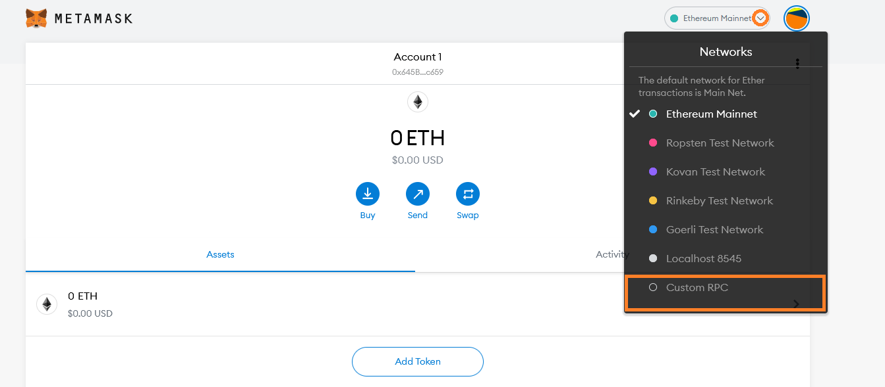

Fill in the form with the following information:

* Network Name: Aurora TestNet
* New RPC URL: `https://testnet.aurora.dev/`
* Chain ID: 1313161555

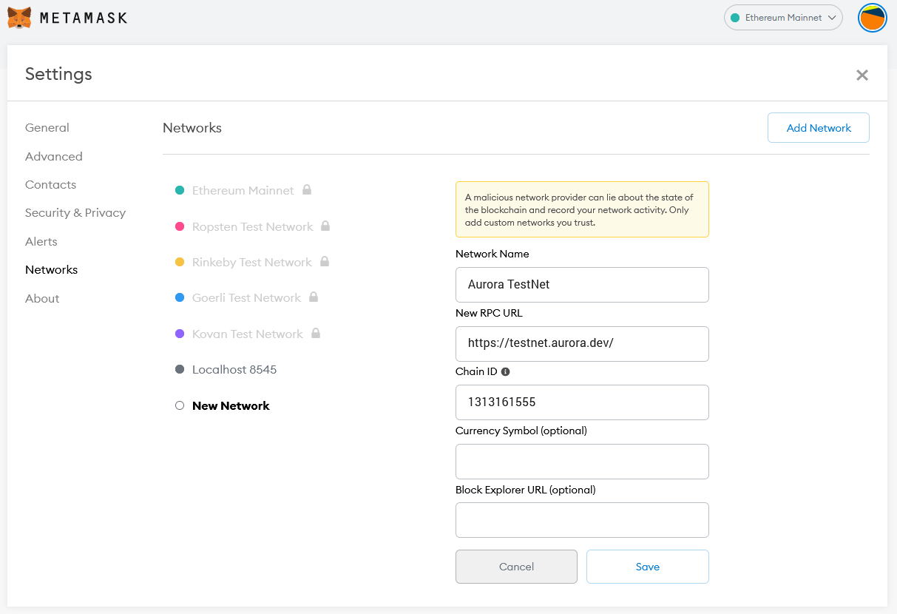

Note: all the Aurora RPC URLs and Chain IDs can be found on our [Networks page](../networks.md).

Click `Save`, and you should see `Aurora TestNet` is now the network selected in MetaMask.
To see MetaMask in action, we will connect it to [Remix] and perform some transactions.

## Deploying an ERC-20 Token using Remix

In a new tab, open the Remix IDE: [https://remix.ethereum.org/](https://remix.ethereum.org/).
It might take a minute to load, but once it has, create a new file `ERC20Token.sol` in the workspace panel on the left.


Copy and paste the following code into the central editor panel.

```solidity
// SPDX-License-Identifier: MIT
pragma solidity ^0.8.0;

import "https://github.com/OpenZeppelin/openzeppelin-contracts/blob/v4.0.0/contracts/token/ERC20/ERC20.sol";

contract MyToken is ERC20 {
    constructor (string memory name, string memory symbol) ERC20(name, symbol) {
        // Mint 100 tokens to msg.sender
        // Similar to how
        // 1 dollar = 100 cents
        // 1 token = 1 * (10 ** decimals)
        _mint(msg.sender, 100 * 10 ** uint(decimals()));
    }
}
```

This code is a slightly modified (solidity compiler and [OpenZeppelin] versions are later) version of the [example from Solidity by Example].

Click the Solidity Compile button on the far left panel (second icon down);
ensure the selected solidity compiler version is 0.8 (minor versions within 0.8, e.g. 0.8.4 work too), and click `Compile ERC20Token.sol`.

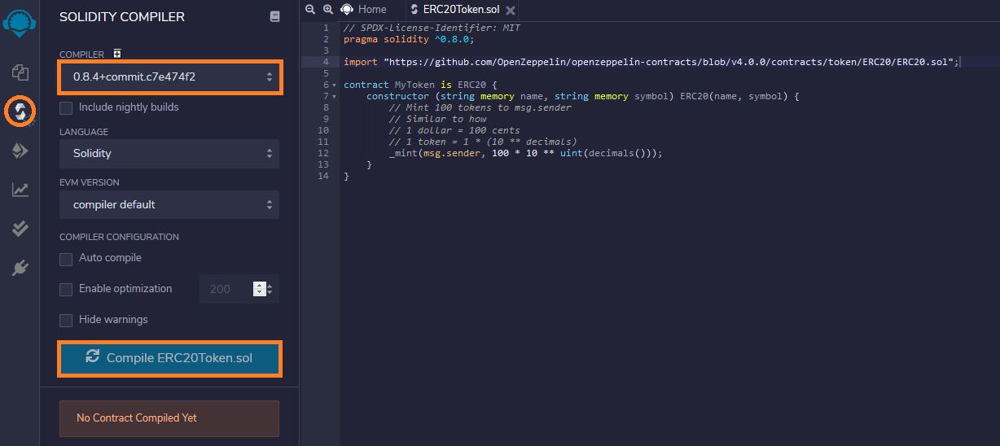

Once the contract is compiled click the Deploy & run transactions button in the far left panel (icon below the solidity compiler).
In the `ENVIRONMENT` drop-down select `Injected Web3`.

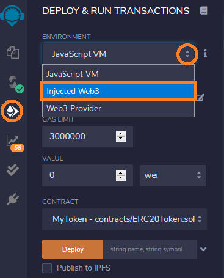

You will see a MetaMask pop-up windown asking you to give the Remix IDE permission to access it.
Click `Next` then `Connect` to grant access.

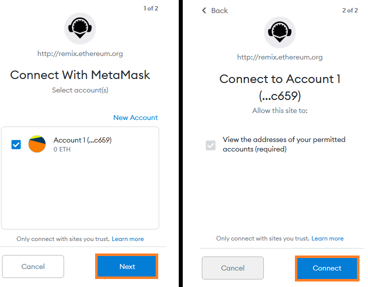

Back on the Remix interface click the arrow next to the `DEPLOY` section of the left panel.
Fill in the token details with whatever you like (`MyToken` and `MT` in the example), and click `transact`.

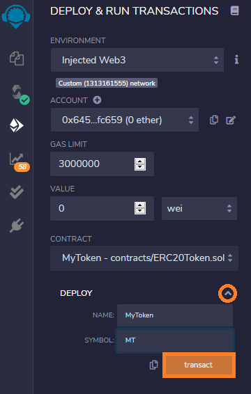

Another MetaMask pop-up will appear asking you to confirm the transaction.
Click `Confirm`.


Note: it may be concerning to see the gas price set to zero in this transaction.
During the early stages of Aurora transactions are free, however this will change in the future.
Even when transaction fees are non-zero, they will always be much lower than on Ethereum 1.0 mainnet.

After a few moments the transaction will be confirmed by the network.
You will see a success message in the bottom panel and the contract listed under `Deployed Contracts` on the left panel.
Click the copy button to copy the address of the newly deployed contract.


Now that the contract is deployed on the Aurora network, we can interact with it via MetaMask.

## Add an ERC-20 token to MetaMask

In the MetaMask interface (with the Aurora TestNet network still selected), click the `Add Token` button.

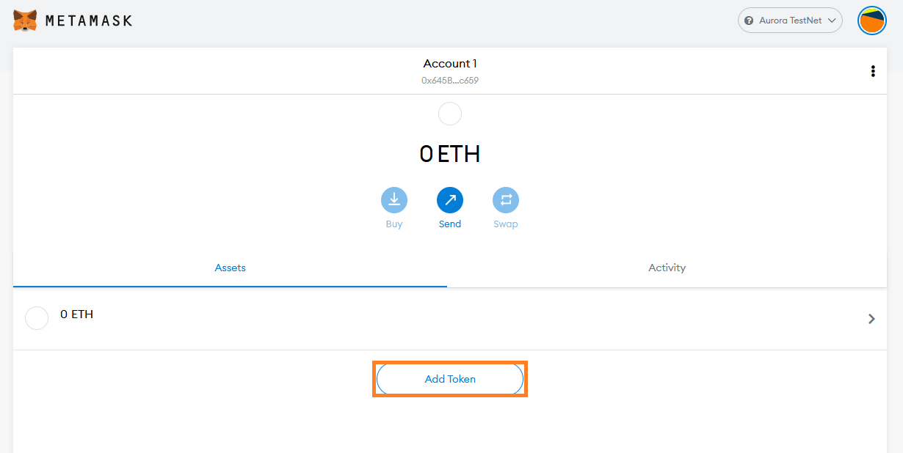

Paste the token address copied from Remix in the previous step.
The remaining token details should fill in automatically as MetaMask finds the contract on-chain.
Click `Next`.

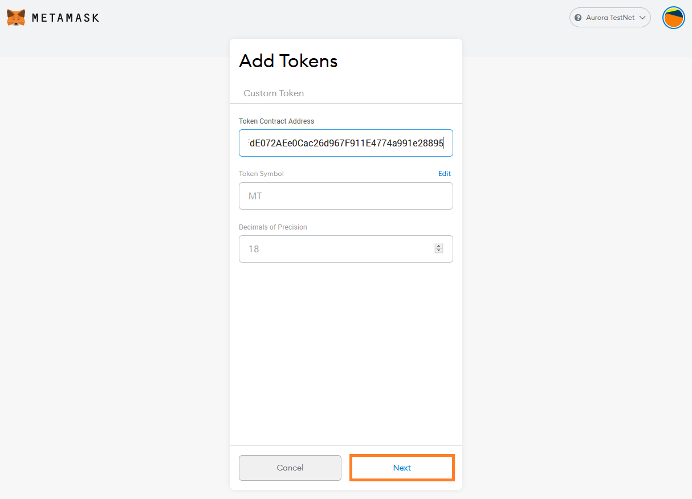

On the next screen you see the balance (100 tokens), as minted in our contract constructor.
Click `Add Tokens`.

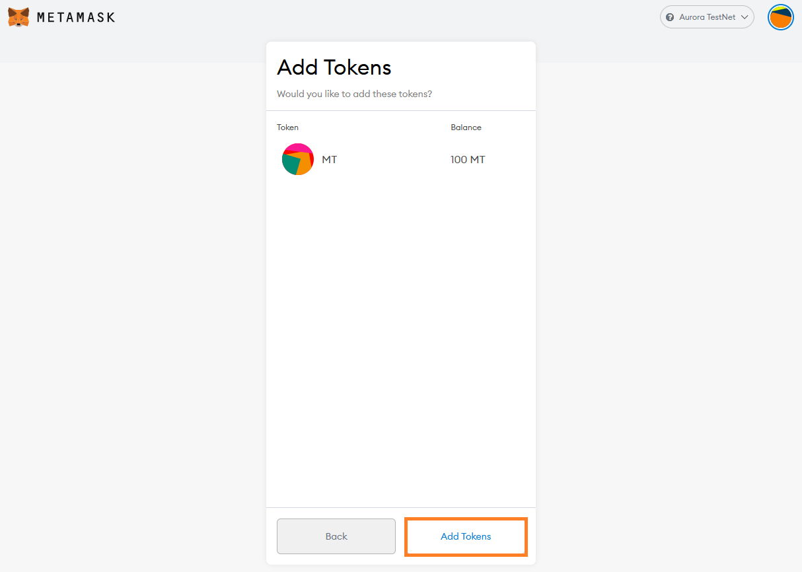

The token has now been added to MetaMask and we can use the MetaMask interface to transfer the token to others.

## Transferring an ERC-20 token with MetaMask

Continuing from the previous step, click the `Send` button in the MetaMask interface.

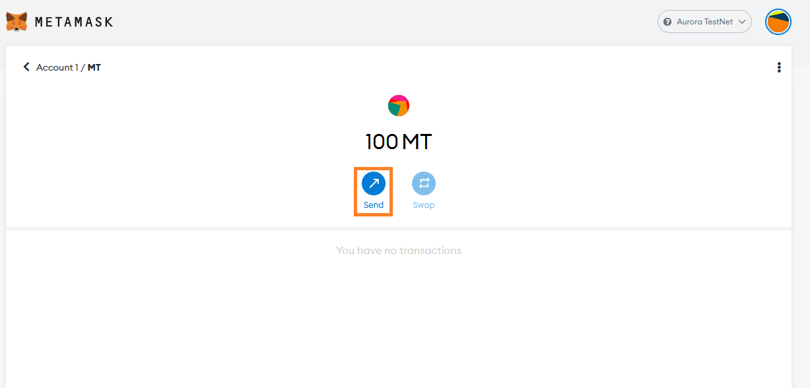

Select a recipient (if you have multiple accounts in MetaMask you can simply select another account), and an amount of tokens to send.
Click `Next`.

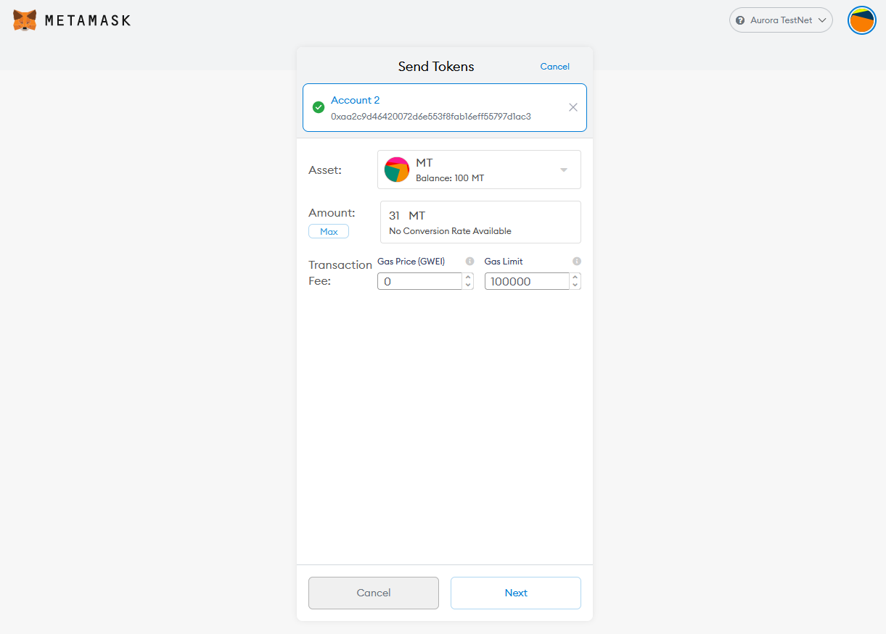

Note: once again the gas price should be set to zero, but this will change in the future.

Click `Confirm` to send the transaction to the network.

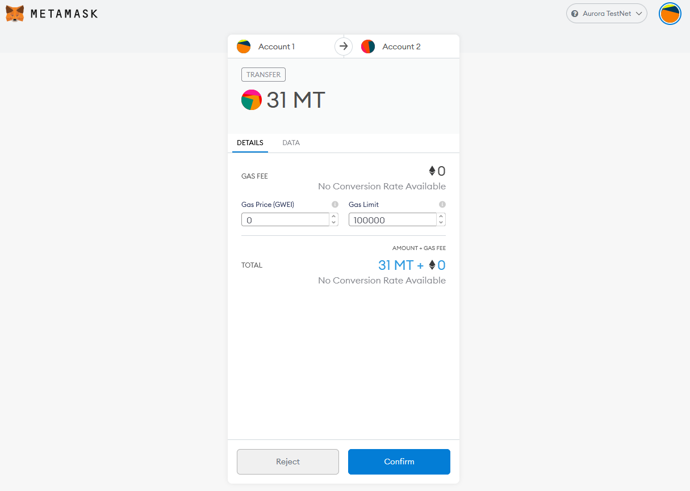

After a few moments the transaction will be confirmed by the network.
You can see the updated balance your account holds in the MetaMask interface.


If you transferred to another MetaMask account you hold then you can follow the instructions for adding the token to MetaMask above on the other account, and view its balance also.

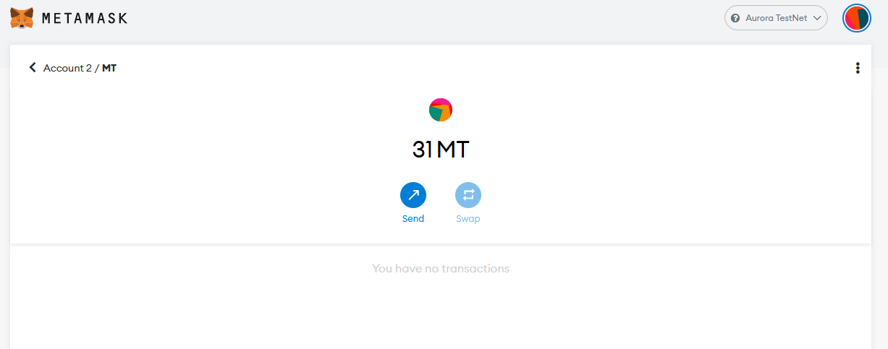

## Summary

In this tutorial we connected MetaMask to the Aurora TestNet, deployed an ERC-20 token contract using Remix, and transferred that token in MetaMask.
The only difference from doing this on an original Ethereum network was setting the RPC to be that of Aurora.

[MetaMask]: https://metamask.io/
[Remix]: https://remix.ethereum.org/
[OpenZeppelin]: https://openzeppelin.com/contracts/
[example from Solidity by Example]: https://solidity-by-example.org/app/erc20/
