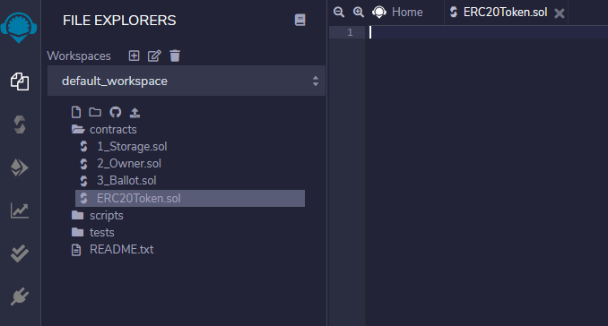
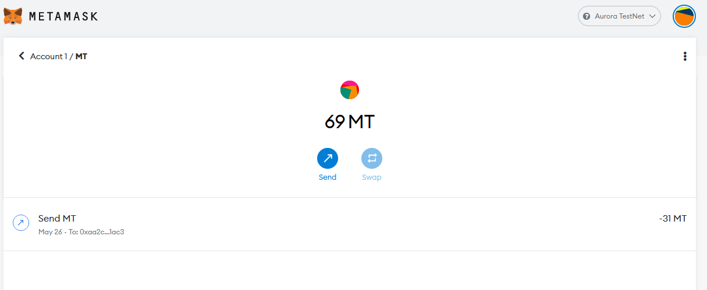

# Getting Started with MetaMask

## Introduction

[MetaMask] is a convenient UI for interacting with Ethereum-compatible blockchains (such as Aurora).
For the purpose of this guide, we will assume you are already familiar with MetaMask and have it installed.
If you need help getting started with MetaMask itself, [check out their documentation](https://metamask.io/faqs.html).

In this tutorial we will walk through connecting MetaMask to the Aurora Testnet, deploying a simple ERC-20 contract using [Remix], and transferring the new token using MetaMask.

!!! note
    Screenshots in this tutorial are taken from the MetaMask browser extension version 9.5.5.

## Connecting MetaMask to Aurora

In the top-right corner of the MetaMask interface, click the network selection drop-down and then click `Custom RPC`.


Fill in the form with the following information:

* Network Name: Aurora Testnet
* New RPC URL: `https://testnet.aurora.dev/`
* Chain ID: 1313161555
* Currency Symbol: ETH


!!! note
    All the Aurora RPC endpoint URLs and chain IDs can be found on our [Networks](../networks.md) page.

Click `Save`, and you should see `Aurora Testnet` is now the network selected in MetaMask.
To see MetaMask in action, we will connect it to [Remix] and perform some transactions.

## Deploying an ERC-20 Token using Remix

In a new tab, open the Remix IDE at [remix.ethereum.org](https://remix.ethereum.org).
It might take a minute to load, but once it has, create a new file `ERC20Token.sol` in the workspace panel on the left:



Copy and paste the following code into the central editor panel:

```solidity
// SPDX-License-Identifier: MIT
pragma solidity ^0.8.0;

import "https://github.com/OpenZeppelin/openzeppelin-contracts/blob/v4.0.0/contracts/token/ERC20/ERC20.sol";

contract MyToken is ERC20 {
    constructor (string memory name, string memory symbol) ERC20(name, symbol) {
        // Mint 100 tokens to msg.sender
        // Similar to how
        // 1 dollar = 100 cents
        // 1 token = 1 * (10 ** decimals)
        _mint(msg.sender, 100 * 10 ** uint(decimals()));
    }
}
```

This code is a slightly modified (the Solidity compiler and [OpenZeppelin] versions are newer) version of the [example from Solidity by Example].

Click the `Solidity Compile` button on the far left panel (the second icon down);
ensure your selected Solidity compiler version is 0.8 (minor versions within 0.8, e.g., 0.8.4 work too), and click `Compile ERC20Token.sol`.


Once the contract is compiled, click the `Deploy & run transactions` button in the far left panel (the icon below the Solidity compiler).
In the `ENVIRONMENT` drop-down select `Injected Web3`.


You will see a MetaMask pop-up window asking you to give the Remix IDE permission to access it.
Click `Next` and then `Connect` to grant access.


Back in the Remix interface, click the arrow next to the `DEPLOY` section of the left panel.
Fill in the token details with whatever you like (`MyToken` and `MT` in the example), and click `transact`.


Another MetaMask pop-up will appear asking you to confirm the transaction.
Click `Confirm`.


!!! note
    You may be surprised to see the gas price set to zero in this transaction.
    During the early access period Aurora transactions are free, however this will change in the future.
    Not to worry, even when transaction fees will be non-zero, they'll still be much lower than on the Ethereum 1.0 Mainnet.

After a few moments the transaction will be confirmed by the network.
You will see a success message in the bottom panel and the contract listed under `Deployed Contracts` on the left panel.
Click the copy button to copy the address of the newly deployed contract.


Now that the contract is deployed on the Aurora network, we can interact with it via MetaMask.

## Adding an ERC-20 Token to MetaMask

In the MetaMask interface (with the Aurora Testnet network still selected), click the `Add Token` button:


Paste the token address copied from Remix in the previous step.
The remaining token details should fill in automatically as MetaMask finds the contract on-chain.
Click `Next`:


On the next screen you see the balance (100 tokens), as minted in our contract constructor.
Click `Add Tokens`:


The token has now been added to MetaMask and we can use the MetaMask interface to view the token balance and to transfer the token to others.

## Transferring an ERC-20 Token with MetaMask

Continuing from the previous step, click the `Send` button in the MetaMask interface:


Select a recipient (if you have multiple accounts in MetaMask you can simply select another account), and an amount of tokens to send.
Click `Next`:


!!! note
    Once again the gas price should be set to zero, but this will change going forward.

Click `Confirm` to send the transaction to the network:


After a few moments the transaction will be confirmed by the network.
You can see the updated balance your account holds in the MetaMask interface:



If you transferred to another MetaMask account you hold then you can follow the aforementioned instructions for adding the token to MetaMask on the other account, and view its balance also.


## Summary

In this tutorial we connected MetaMask to the Aurora Testnet, deployed an ERC-20 token contract using Remix, and transferred that token using MetaMask.
The only difference to doing this on the original Ethereum network was setting the RPC endpoint to be Aurora's.

[MetaMask]: https://metamask.io
[Remix]: https://remix.ethereum.org
[OpenZeppelin]: https://openzeppelin.com/contracts/
[example from Solidity by Example]: https://solidity-by-example.org/app/erc20/
