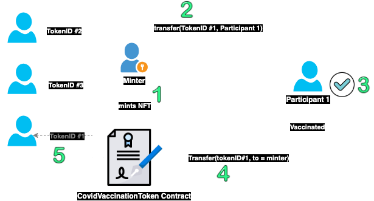

# Deploying a Contract Using Truffle

## Introduction

[Truffle](https://www.trufflesuite.com/) is widely used development environment and testing framework for  Ethereum smart contracts. In this tutorial, we will show how to use `Truffle` with Aurora Testnet by example. 

This tutorial assumes that you are familiar with `Truffle` and the non-fungible tokens (NFT) concept. For more details about the non-fungible token standard (ERC721), please refer to [ERC-721 non-fungible token standard](https://ethereum.org/en/developers/docs/standards/tokens/erc-721/).

## NFT Example

This example is originally forked from [OpenZeppelin examples](https://docs.openzeppelin.com/contracts/4.x/erc721). However the code was changed to fit the use case of this tutorial. The use case is about how to deploy and manage the life cycle of a simple COVID-19 vaccine NFT token 💊💊 using Truffle on Aurora testnet.



1. The `minter` address (which is managed by the vaccination program manager) can distribute (mint) the vaccine tickets (NFT tokens 💊💊💊) to the people who are part of the vaccination program. 
2. When participants receive the tokens 💊, they can get access to the vaccine by spending the NFT token. 
3. This means either burning the NFT token or sending it back to the minter address.
4. If the participant chose to send it back then the minter can redistribute that token 🎫 to another participant in the line.
5. Then the new participant will have access to the same vaccine token that has been used by the old participant.


## Installing Prerequisites
This tutorial assumes that you have `Node 12+` and `yarn`. Please refer to the [Yarn installation page](https://classic.yarnpkg.com/en/docs/install) if you don't have `yarn` installed locally.

To install the prerequisites packages, clone the examples code then run `yarn` in order to install the prerequisites:
 
 - Install Truffle:
```bash
npm install -g truffle 
```
- Install dependecies:
```bash
git clone https://github.com/aurora-is-near/aurora-examples.git
cd aurora-examples/truffle/erc721-example/
yarn 
```

## Connecting Truffle to Aurora

Export your `MNEMONIC` as follows:
```
export MNEMONIC='YOUR MNEMONICS HERE'
```

Now in `truffle-config.js`, you have to change the `from` address as shown below in the aurora network section.

```
...
aurora: {
      provider: () => setupWallet('https://testnet.aurora.dev'),
      network_id: 0x4e454153,
      gas: 10000000,
      from: '0x6A33382de9f73B846878a57500d055B981229ac4' // CHANGE THIS ADDRESS
    },
```
The `truffle-config.js` will pickup your `MNEMONIC` and recover the address that will be used for sending, and signing transactions on Aurora network.

## Deploying The Contract

To deploy the `CovidVaccineToken` contract, you can run the yarn command as follows:

```
yarn deploy:aurora
....
_deploy_contracts.js
=====================

   Deploying 'CovidVaccineToken'
   -----------------------------
   > transaction hash:    0x282012c791d65d0ce2fd1fd9fcc41179dba5bd06c3b02e31e53dbe9cc8af62c1
   > Blocks: 7            Seconds: 5
   > contract address:    0x3635D999d8CdA2fAf304b390fb26a9c2f364dFbd
   > block number:        49151611
   > block timestamp:     1622034185
   > account:             0x6A33382de9f73B846878a57500d055B981229ac4
   > balance:             0
   > gas used:            2576274 (0x274f92)
   > gas price:           20 gwei
   > value sent:          0 ETH
   > total cost:          0.05152548 ETH
....
```

## Play with Truffle console

Now you can test the flow as mentioned in the NFT Example section:

### Mint

Minter mints and transfers NFT tokens for the vaccine program participant. In this example, the new participant address is `0x2531a4D108619a20ACeE88C4354a50e9aC48ecfe` and the minter address is `0x6A33382de9f73B846878a57500d055B981229ac4`.

Please make sure that you are using the same deployer address as a minter address otherwise the `mint` transaction will revert.

```bash
% truffle console --network aurora
truffle(aurora)> const cvt = await CovidVaccineToken.deployed()
truffle(aurora)> await cvt.minter()
'0x6A33382de9f73B846878a57500d055B981229ac4'
truffle(aurora)> await cvt.mint('0x2531a4D108619a20ACeE88C4354a50e9aC48ecfe' , {from: accounts[0]})
```

You should notice that `accounts[0]` is the minter address and all the participants are not allowed to transfer their NFT tokens except for the minter. 

So lets try to use any participant address to validate this. To do that, change the value of `from` to `accounts[1]`, so the sender will be the first participant (e.g the participant address `0x2531a4D108619a20ACeE88C4354a50e9aC48ecfe`).


In the truffle console: 
```bash
truffle(aurora)> await cvt.safeTransferFrom('0x2531a4d108619a20acee88c4354a50e9ac48ecfe', '0x8722C88e82AbCC639148Ab6128Cd63333B2Ad771', 1, {from: accounts[1]}) 
Uncaught Error: execution reverted:
...
reason: 'Invalid Transfer',
  hijackedStack: 'Error: execution reverted:\n'
```
This is exactly the same error message we have in our NFT contract in `safeTransferFrom`: 
```javascript
function safeTransferFrom(
    address from, 
    address to, 
    uint256 tokenId
) 
    public 
    virtual 
    override 
    {
        require(
            minter == msg.sender || to == minter,
            'Invalid Transfer'
        );
        safeTransferFrom(from, to, tokenId, "");
    }
```
### Transfer

Participant can transfer the token to the `minter` after receiving the vaccine. As shown below a participant can only send the NFT token if the receiver for this token is the minter (`0x6A33382de9f73B846878a57500d055B981229ac4`). 

```bash
truffle(aurora)> await cvt.ownerOf(1) // TokenID 1
'0x2531a4D108619a20ACeE88C4354a50e9aC48ecfe'
truffle(aurora)> await cvt.minter()
'0x6A33382de9f73B846878a57500d055B981229ac4'
truffle(aurora)> await cvt.safeTransferFrom('0x2531a4D108619a20ACeE88C4354a50e9aC48ecfe', '0x6A33382de9f73B846878a57500d055B981229ac4', 1 , {from: accounts[1]})
truffle(aurora)> await cvt.ownerOf(1) // TokenID 1
'0x6A33382de9f73B846878a57500d055B981229ac4'
```

### Burn
This is an alternative scenario for the NFT token lifecycle. Instead of transfering the token back to the `minter`, the participant can decide to burn the NFT token by calling the `burn` function:
```bash
truffle(aurora)> await cvt.burn(1, {from: accounts[1]}) // 1 is the tokenID
```

### Redistribute

Finally, the `minter` can send the same token (if not burnt) to a new partcipant in the line:

```bash
truffle(aurora)> await cvt.safeTransferFrom('0x6A33382de9f73B846878a57500d055B981229ac4','0x8722C88e82AbCC639148Ab6128Cd63333B2Ad771', 1 , {from: accounts[0]})
truffle(aurora)> await cvt.ownerOf(1)
'0x8722C88e82AbCC639148Ab6128Cd63333B2Ad771'
```
## Summary:

This simple NFT example shows how to deploy a contract with Truffle and invoke transactions on Aurora testnet.
