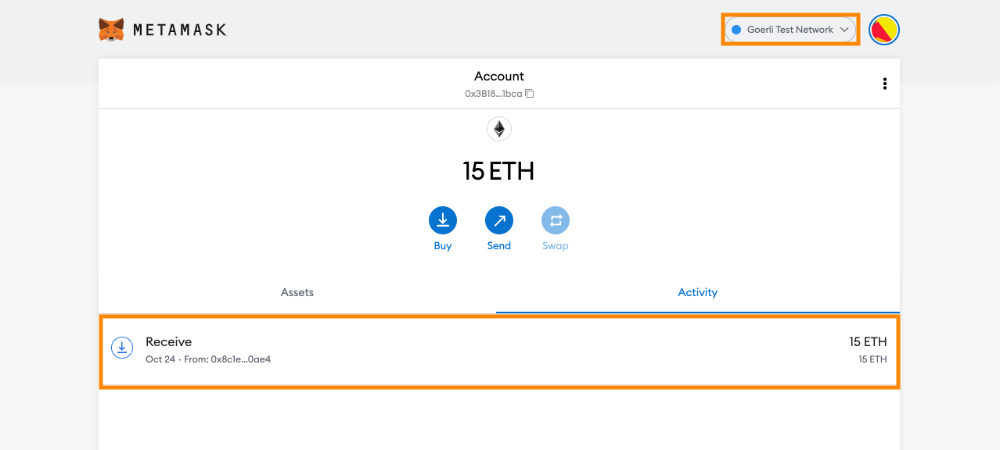
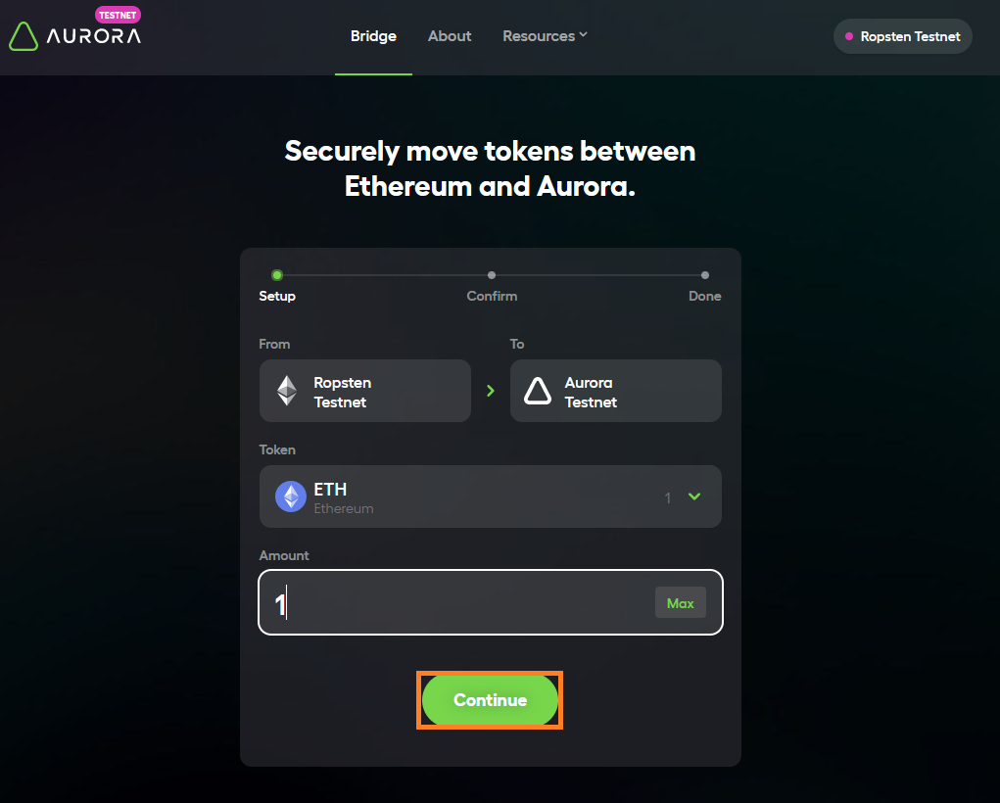
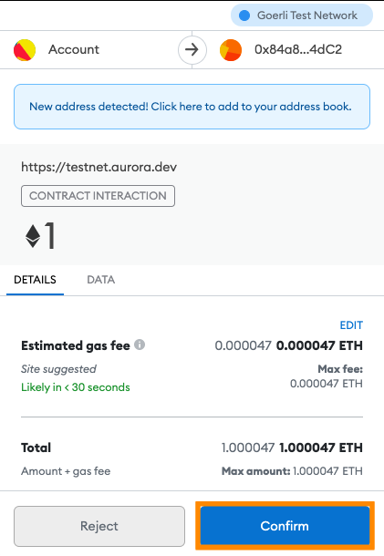
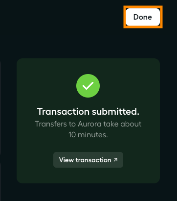
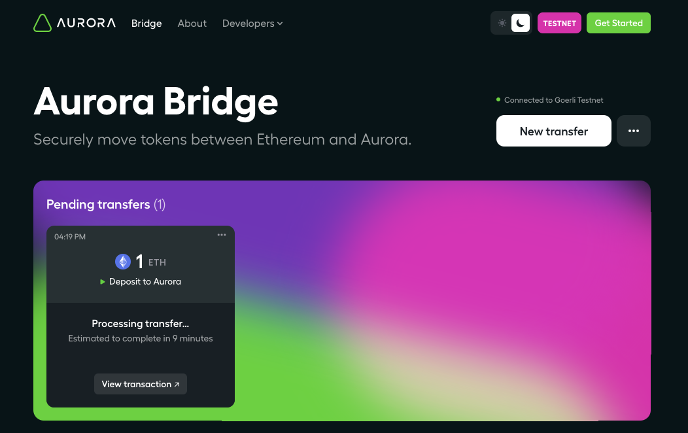
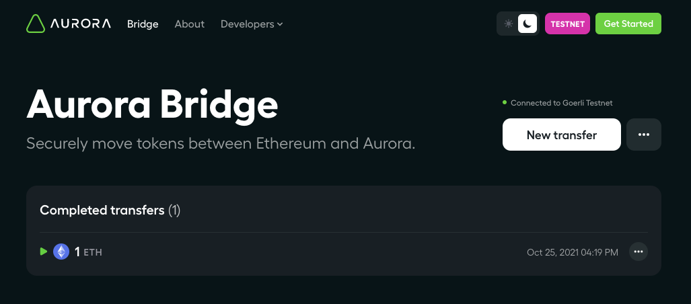
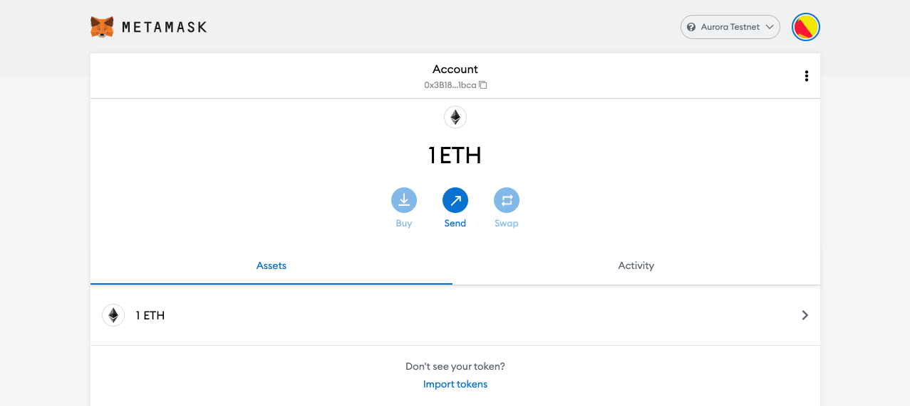

# Bridging ETH Balances

!!! note
    Bridging ETH is currently only enabled for Goerli Testnet to Aurora Testnet.

Before you begin, ensure you have the Goerli Testnet selected in MetaMask (see instructions [here](../connect/metamask.md)).

For this tutorial, you should have (at least) 2 Goerli ETH already on your account.

If you don't have Goerli ETH to transfer, you can get some from faucets such as [Goerli Authenticated Faucet](https://faucet.goerli.mudit.blog/).

Go to [the Bridge webpage](https://testnet.aurora.dev/bridge).
If you have not yet connected MetaMask to the UI, follow the instructions [here](../connect/metamask.md).

Click the `New transfer` button in the top right.

Enter the amount of ETH to transfer in the `Amount to transfer` box (in this example we send 1 ETH) then click `Confirm Transfer` button.

Click `Confirm`, then confirm the transaction in the MetaMask pop-up.

You have confirmed the display that the `Transaction submitted` in the Bridge UI, then click the `Done` button.

After a minute or two the transaction on the Goerli network will confirm in MetaMask.
At this point the ETH is locked on the Goerli side in a contract, and it has emitted a `Deposit` event.
The Aurora relayers watch for such events and automatically forward a transaction to the NEAR network (where Aurora runs).
This takes some time because we must wait for multiple block confirmations on Goerli to be sure it will not revert.

While this is happening you will see an intermediate state in the `Pending transfers` box.

After the transaction is complete (several minutes later) it will appear ETH you sent in the `Completed transfers` box.

You can now see your balance in MetaMask by switching to the Aurora Testnet.

