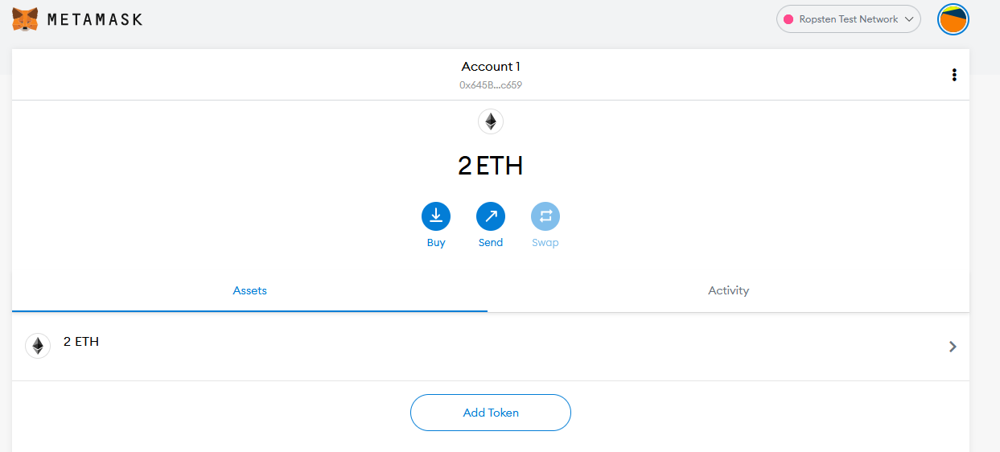
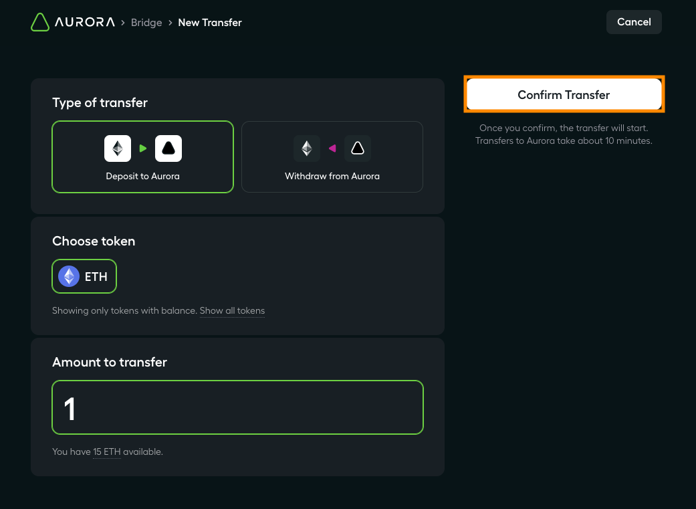

# Bridging ETH Balances

!!! note
    Bridging ETH is currently only enabled for Ropsten Testnet to Aurora Testnet.

Before you begin, ensure you have the Ropsten Testnet selected in MetaMask (see instructions [here](../connect/metamask.md)).

If you need Ropsten ETH to transfer, you can get some from faucets such as [MetaMask's](https://faucet.metamask.io/) or [DeFi Karen's](https://faucet.ropsten.be/).
For this tutorial, you should have (at least) 2 Ropsten ETH already on your account.

Go to the [Bridge UI](https://testnet.aurora.dev/bridge).
If you have not yet connected MetaMask to the UI, follow the instructions [here](../connect/metamask.md).
Enter the amount of ETH to transfer in the `Amount` box (in this example we send 1 ETH) then click `Continue`.

Click `Confirm`, then confirm the transaction in the MetaMask pop-up.

After a minute or two the transaction on the Ropsten network will confirm in MetaMask.
At this point the ETH is locked on the Ropsten side in a contract, and it has emitted a `Deposit` event.
The Aurora relayers watch for such events and automatically forward a transaction to the NEAR network (where Aurora runs).
This takes some time because we must wait for multiple block confirmations on Ropsten to be sure it will not revert.
While this is happening you will see an intermediate message in the Bridge UI.

After the transaction is complete (several minutes later) it will appear as "Completed" in the UI.

You can now see your balance in MetaMask by switching to the Aurora Testnet.

