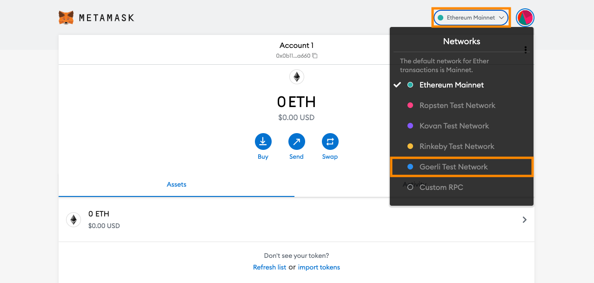
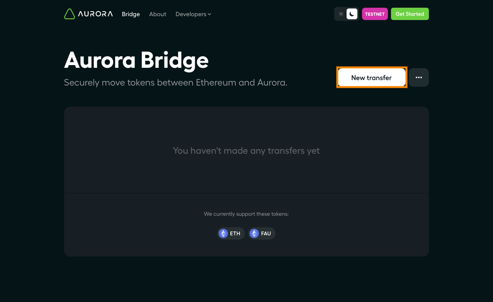
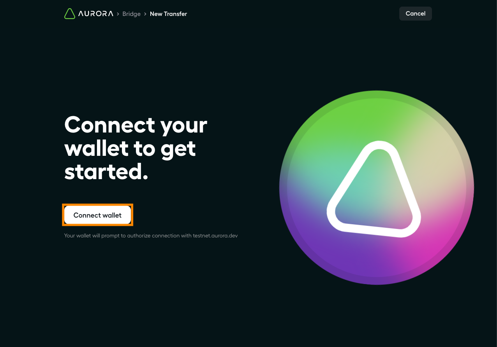
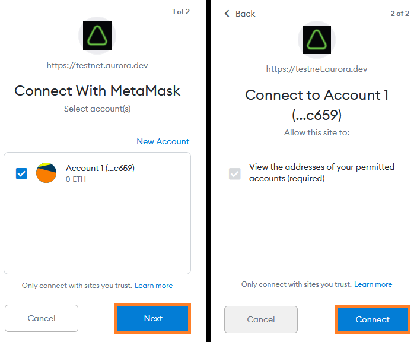
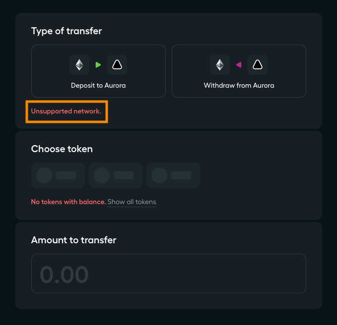
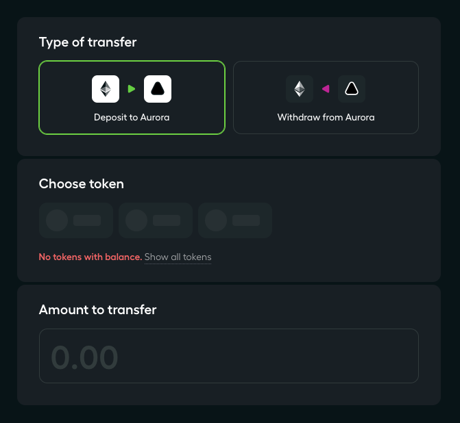
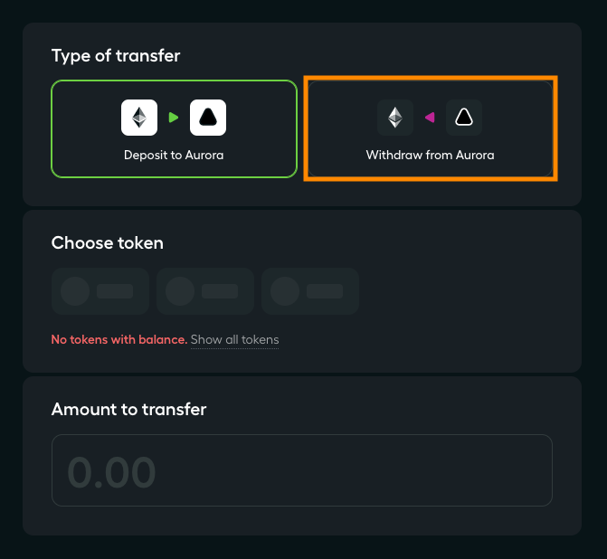
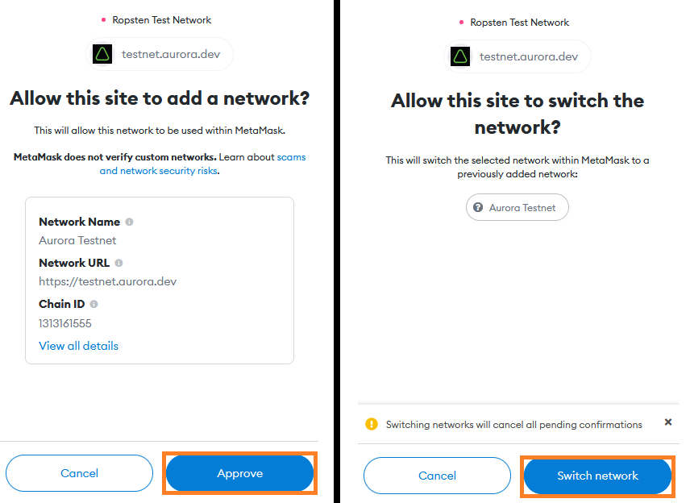
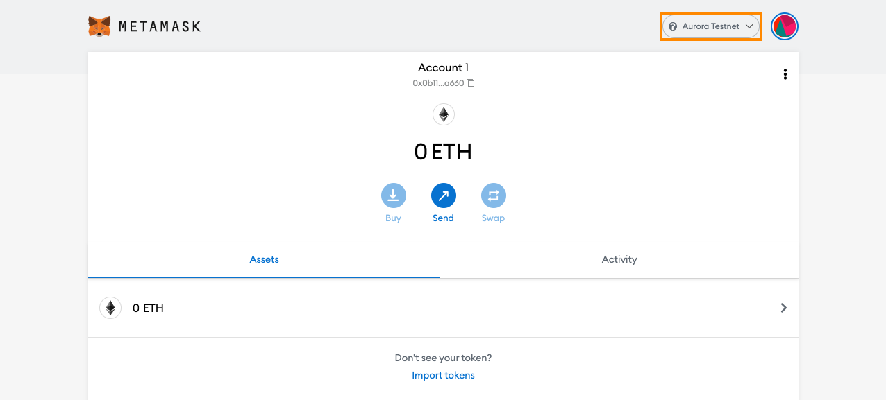

# Connecting with MetaMask

The easiest way to connect Aurora to MetaMask is to use the Bridge UI.
If you want to manually add Aurora as a custom RPC in MetaMask, then check out the [tutorial under the Develop tab].
If that last sentence didn't make sense to you, that's good, you're in the right place.

We assume you already have the MetaMask browser extension installed.git
If you need help getting set up with MetaMask in the first place, please see [their website](https://metamask.io/).

## Connecting to the Bridge front-end

Aurora is still a work in progress, so our bridge is currently only working with the Goerli Testnet (an Ethereum test network).
For the remainder of the tutorial we will focus on adding the Aurora Testnet to MetaMask.

Before we begin, ensure that you have the Goerli network selected in MetaMask.
In the MetaMask UI click the network selection drop-down in the top right, then click `Goerli test network`.

Go to [the Bridge webpage](https://testnet.aurora.dev/bridge) and click the `New transfer` button in the top right.

You will be taken to the wallet connection page, click the `Connect wallet` button.

In the pop-up MetaMask window click `Next` then `Connect`.

If you see `Unsupported network` in the Type of transfer on the Bridge page, make sure you have the Goerli network selected in MetaMask (per the previous steps).

Otherwise you should now see the Deposit to Aurora surrounded by a green border.

To connect MetaMask with Aurora, click the `Withdraw from Aurora` in the Type of transfer.

In the MetaMask pop-up window click `Approve` then `Switch network`.

That's it! If you look in the MetaMask UI you will see that you are now connected to the `Aurora Testnet` network.

## Next steps

While you are on the bridge page, why not [transfer some ETH from your account on Goerli to your account on Aurora]?
Or if you want to try deploing a smart contract, check out the [tutorial using Remix with MetaMask].

[tutorial under the Develop tab]: ../../develop/start/metamask.md
[transfer some ETH from your account on Goerli to your account on Aurora]: ../bridge/eth.md
[tutorial using Remix withvi ~/.ssh/config MetaMask]: /develop/start/metamask.html#deploying-an-erc-20-token-using-remix
